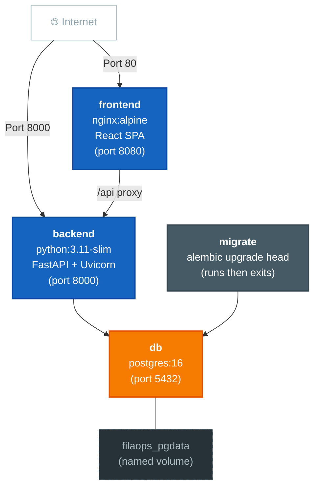

# FilaOps Deployment Guide

Production deployment for the FilaOps ERP system using Docker Compose.

## Architecture Overview



| Service | Image | Purpose |
|---------|-------|---------|
| `db` | `postgres:16` | PostgreSQL database |
| `migrate` | Backend image | Runs `alembic upgrade head`, then exits |
| `backend` | `python:3.11-slim` | FastAPI API server on port 8000 |
| `frontend` | `nginx:alpine` | Serves React SPA, proxies `/api` to backend |

## 1. Prerequisites

- **Docker Engine** 24+ and **Docker Compose** v2
- **2 GB RAM** minimum (4 GB recommended for production)
- **Ports**: 80 (frontend), 8000 (API), 5432 (PostgreSQL)
- **Git** to clone the repository

```bash
docker --version
docker compose version
```

## 2. Quick Start

```bash
git clone https://github.com/Blb3D/filaops.git
cd filaops

# Create environment file from the template
cp backend/.env.example .env

# Edit .env — at minimum set these:
#   DB_PASSWORD=<strong-random-password>
#   SECRET_KEY=<64-char-hex-string>
#   ALLOWED_ORIGINS=https://your-domain.com
#   ENVIRONMENT=production

# Start all services
docker compose up -d --build

# Verify
docker compose ps
curl http://localhost:8000/health
```

The `migrate` service runs automatically before the backend starts, applying any
pending Alembic migrations. The backend waits for it via `service_completed_successfully`.

## 3. Environment Variables Reference

Copy `backend/.env.example` to `.env` in the project root. Docker Compose reads it automatically.

### Required

| Variable | Default | Description |
|----------|---------|-------------|
| `DB_HOST` | `localhost` | PostgreSQL host. Use `db` inside Docker Compose. |
| `DB_PORT` | `5432` | PostgreSQL port |
| `DB_NAME` | `filaops` | Database name |
| `DB_USER` | `postgres` | Database user |
| `DB_PASSWORD` | - | Database password. **Must change in production.** |
| `SECRET_KEY` | - | JWT signing key. Generate: `python -c "import secrets; print(secrets.token_hex(32))"` |
| `ALLOWED_ORIGINS` | `http://localhost` | Comma-separated CORS origins (match your frontend URL/port) |
| `ENVIRONMENT` | `development` | Set to `production` for deployments |

### Optional

| Variable | Default | Description |
|----------|---------|-------------|
| `DATABASE_URL` | - | Full connection string. Overrides individual `DB_*` vars. |
| `FRONTEND_URL` | `http://localhost` | Used for email links and redirects |
| `ACCESS_TOKEN_EXPIRE_MINUTES` | `30` | JWT token lifetime |
| `LOG_LEVEL` | `INFO` | `DEBUG`, `INFO`, `WARNING`, `ERROR` |
| `LOG_FORMAT` | `json` | Log format: `json` or `text` |
| `TIER` | `community` | Edition tier. Leave as `community` for open-source. |
| `SENTRY_DSN` | - | Sentry error tracking DSN |
| `REDIS_URL` | - | Redis connection for background jobs |

See `backend/.env.example` for the full list including SMTP, shipping, MRP, and pricing.

## 4. Production Docker Compose Setup

The included `docker-compose.yml` is production-ready:

- **Backend** runs as `appuser` (non-root) inside the container
- **Frontend** runs as `nginx` user (non-root)
- **Database** data persists in the `filaops_pgdata` named volume
- **Uploads** are bind-mounted at `./uploads:/app/uploads`

### Production `.env` Example

```env
DB_HOST=db
DB_PORT=5432
DB_NAME=filaops
DB_USER=filaops_app
DB_PASSWORD=use-a-64-char-random-string-here
SECRET_KEY=another-64-char-random-string-here
ENVIRONMENT=production
ALLOWED_ORIGINS=https://erp.example.com
FRONTEND_URL=https://erp.example.com
LOG_LEVEL=INFO
LOG_FORMAT=json
```

### Start / Stop

```bash
docker compose up -d --build       # Start
docker compose down                # Stop (keeps data)
docker compose down -v             # Stop and DESTROY database volume
```

## 5. Database Migrations

Migrations run **automatically** via the `migrate` service on every `docker compose up`.
The service waits for PostgreSQL health, runs `alembic upgrade head`, then exits.
The backend starts only after migrate succeeds.

### Manual Commands

```bash
docker compose run --rm migrate alembic current       # Check revision
docker compose run --rm migrate alembic history        # View history
docker compose run --rm migrate alembic downgrade -1   # Rollback one step
```

### Pre-Migration Backup

```bash
docker compose exec db pg_dump -U postgres filaops > backup_$(date +%Y%m%d_%H%M%S).sql
```

See `docs/ROLLBACK.md` for full rollback procedures.

## 6. TLS/SSL with a Reverse Proxy

The Docker stack listens on HTTP. Terminate TLS at a reverse proxy in front.

### Option A: Caddy (Automatic HTTPS)

Create `/etc/caddy/Caddyfile`:

```caddyfile
erp.example.com {
    reverse_proxy localhost:80
}
```

Caddy obtains and renews Let's Encrypt certificates automatically:

```bash
sudo systemctl enable caddy && sudo systemctl start caddy
```

### Option B: nginx

Create `/etc/nginx/sites-available/filaops`:

```nginx
server {
    listen 80;
    server_name erp.example.com;
    return 301 https://$server_name$request_uri;
}

server {
    listen 443 ssl http2;
    server_name erp.example.com;

    ssl_certificate     /etc/letsencrypt/live/erp.example.com/fullchain.pem;
    ssl_certificate_key /etc/letsencrypt/live/erp.example.com/privkey.pem;

    location / {
        proxy_pass http://127.0.0.1:80;
        proxy_set_header Host $host;
        proxy_set_header X-Real-IP $remote_addr;
        proxy_set_header X-Forwarded-For $proxy_add_x_forwarded_for;
        proxy_set_header X-Forwarded-Proto $scheme;
    }
}
```

With a host-level proxy, bind the frontend to localhost only:

```yaml
frontend:
  ports:
    - "127.0.0.1:8080:8080"
```

Update `ALLOWED_ORIGINS` and `FRONTEND_URL` to use `https://`.

!!! tip "Proxy headers (v3.7.1+)"
    FilaOps passes `--proxy-headers --forwarded-allow-ips '*'` to uvicorn automatically. This means redirect responses (e.g. trailing-slash redirects) will correctly use `https://` when the backend is behind nginx or Traefik. No additional configuration is required — just ensure your reverse proxy sets `X-Forwarded-Proto: https`.

## 7. Health Checks

### Backend `/health` Endpoint

```bash
curl -s http://localhost:8000/health | python -m json.tool
```

Returns HTTP 200 when healthy, 503 when not:

```json
{ "status": "healthy", "checks": { "database": "ok" }, "version": "3.2.0" }
```

### Docker Health Checks

| Service | Check | Interval |
|---------|-------|----------|
| `db` | `pg_isready -U $POSTGRES_USER -d $POSTGRES_DB` | 5s |
| `backend` | HTTP GET `http://localhost:8000/health` | 30s |

```bash
docker compose ps
docker inspect --format='{{json .State.Health}}' filaops-backend | python -m json.tool
```

## 8. Logging and Monitoring

### Structured JSON Logs

With `LOG_FORMAT=json` (the default), the backend emits structured logs:

```json
{ "timestamp": "2026-01-15T10:30:00Z", "level": "INFO", "logger": "app.main", "message": "Request completed", "request_id": "abc-123-def" }
```

### X-Request-ID Correlation

Every request gets an `X-Request-ID` header (preserved from client or generated as UUID4).
The ID appears in response headers and all log entries for that request, enabling
end-to-end tracing in log aggregation systems.

### Viewing Logs

```bash
docker compose logs -f backend          # Live tail
docker compose logs --tail=100 backend  # Last 100 lines
```

For production, configure log rotation in `docker-compose.yml`:

```yaml
backend:
  logging:
    driver: "json-file"
    options:
      max-size: "50m"
      max-file: "5"
```

Compatible with Loki, Datadog, ELK, or any system that reads Docker JSON logs.

## 9. Updating / Upgrading

```bash
cd filaops
git pull origin main

# Back up first
docker compose exec db pg_dump -U postgres filaops > backup_$(date +%Y%m%d_%H%M%S).sql

# Rebuild (migrate runs automatically)
docker compose up -d --build

# Verify
curl -s http://localhost:8000/health
```

To upgrade to a specific release:

```bash
git fetch --tags
git checkout v3.2.0
docker compose up -d --build
```

See `docs/VERSIONING.md` for version management details.

## 10. Scaling Considerations

FilaOps is designed for **single-node deployment**. A single server handles
typical 3D print farm operations comfortably.

### Connection Pooling

SQLAlchemy manages a connection pool. For high load, tune via `DATABASE_URL`:

```
postgresql+psycopg://user:pass@db:5432/filaops?pool_size=10&max_overflow=20
```

### Resource Recommendations

| Workload | RAM | CPU | Disk |
|----------|-----|-----|------|
| Small farm (1-5 printers) | 2 GB | 2 cores | 20 GB |
| Medium farm (5-20 printers) | 4 GB | 4 cores | 50 GB |
| Large farm (20+ printers) | 8 GB | 4+ cores | 100 GB |

File uploads (3MF, STL) are stored at `./uploads` on the host. Plan disk accordingly.

## 11. Troubleshooting

### Backend won't start

```bash
docker compose logs backend    # Check for errors
docker compose logs migrate    # Usually the migrate service failed
```

Fix the issue and restart: `docker compose up -d migrate && docker compose up -d backend`

### Database connection refused

```bash
docker compose ps db
docker compose exec db pg_isready -U postgres
ss -tlnp | grep 5432          # Linux — check port conflict
```

### Frontend blank page or API errors

```bash
docker compose exec frontend wget -qO- http://backend:8000/health
docker compose exec backend env | grep ALLOWED
```

The frontend nginx proxies `/api` to the backend. Check `VITE_API_URL` build arg
and `frontend/nginx.conf` if API calls fail.

### Migrations: "relation already exists"

```bash
docker compose run --rm migrate alembic current
docker compose run --rm migrate alembic stamp head    # Sync tracker to actual state
```

### Permission denied on uploads

The backend runs as `appuser` (UID 1000):

```bash
sudo chown -R 1000:1000 ./uploads && chmod 755 ./uploads
```

### Out of disk space

```bash
docker system df              # Check usage
docker system prune -f        # Clean unused images/cache
```

### Full reset (development only)

```bash
# WARNING: Destroys all data
docker compose down -v
docker compose up -d --build
```
