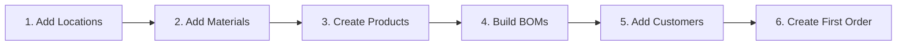

# Your First Day

> Create your admin account, load sample data, and take a guided tour of FilaOps.

## What You'll Learn

- How to create your first admin account
- How to load example data so you can explore the system
- How to import your own products, customers, and orders
- Where everything lives in the sidebar navigation
- How to configure your company settings

## The Setup Wizard

When you open FilaOps for the first time, the **Onboarding Wizard** walks you through seven quick steps. You only see this wizard once — on a brand-new installation with no users.

<!-- TODO: screenshot of onboarding wizard Step 1 -->

### Step 1: Create Admin Account

Fill in the form with your details:

| Field | Description |
|-------|-------------|
| **Your Name** | First and last name |
| **Email Address** | Used for login |
| **Password** | Must include uppercase, lowercase, a number, and a special character |
| **Confirm Password** | Re-type your password |
| **Company Name** | Optional — you can set this later in Settings |

Click **Create Admin Account**. You're now logged in and the wizard advances automatically.

!!! tip "Password requirements"
    Your password must be at least 8 characters and include:

    - An uppercase letter (A-Z)
    - A lowercase letter (a-z)
    - A number (0-9)
    - A special character (!@#$%^&*)

### Step 2: Load Example Data

The wizard offers to populate your database with sample items and materials — filament types, example products, and standard units of measure. This is a great way to explore FilaOps before entering your own data.

- **Load Example Data** (recommended for first-time users) — creates sample PLA/ABS/PETG filaments, a few example products, color variants, and standard UOMs (grams, kilograms, meters, etc.)
- **Skip** — start with a completely empty database

!!! info "Example data is harmless"
    You can always delete sample items later. They don't interfere with real data you add afterward.

### Step 3: Import Products

Upload a CSV file containing your products, or click **Skip** to add products manually later. The CSV importer accepts columns like `name`, `sku`, `description`, `selling_price`, and `cost`.

### Step 4: Import Customers

Upload a CSV of your customers (name, email, phone, address), or skip this step.

### Step 5: Import Orders

Upload orders exported from your e-commerce platform (Etsy, Shopify, etc.) as CSV, or skip to enter orders manually.

### Step 6: Import Inventory

Upload a CSV with current inventory levels, or skip and enter stock counts later using the **Cycle Count** feature.

### Step 7: Complete

Click **Go to Dashboard** to enter FilaOps. The wizard is finished — you won't see it again.

!!! tip "You can always import later"
    If you skip the CSV steps during setup, every import option remains available from the sidebar. Go to **Inventory > Import Materials** for materials, or **Admin > Import Orders** for order CSVs.

---

## Finding Your Way Around

After the wizard, you land on the **Dashboard**. The left sidebar is your main navigation. Here's a map of every section:

### Sidebar Navigation

<!-- TODO: screenshot of sidebar fully expanded -->

| Group | Page | What It's For |
|-------|------|---------------|
| — | **Dashboard** | At-a-glance business health: revenue, orders, production status |
| — | **Command Center** | Live printer status and real-time production overview |
| **SALES** | **Orders** | Create, track, and fulfill customer orders |
| | **Quotes** | Prepare price quotes and convert them to orders |
| | **Payments** | Record and track payments against orders |
| | **Customers** | Customer directory with contact info and order history |
| **INVENTORY** | **Items** | Your product catalog — finished goods, raw materials, and components |
| | **Import Materials** | Bulk-import filament and material data from CSV |
| | **Bill of Materials** | Define what goes into each product (recipes) |
| | **Locations** | Warehouses, shelves, and storage bins |
| | **Transactions** | Full audit trail of every stock movement |
| | **Cycle Count** | Batch inventory verification and adjustments |
| | **Material Spools** | Track individual filament spools with lot numbers |
| **OPERATIONS** | **Production** | Production orders and operation scheduling |
| | **Manufacturing** | Work center management and routing templates |
| | **Printers** | Your printer fleet — status, maintenance, utilization |
| | **Purchasing** | Purchase orders for restocking materials |
| | **Shipping** | Shipment tracking and carrier management |
| **QUALITY** | **Material Traceability** | Track materials from receipt through finished product |
| **ADMIN** | **Accounting** | Revenue tracking, COGS, tax reports |
| | **Import Orders** | Bulk-import orders from CSV |
| | **Team Members** | Add and manage user accounts |
| | **Scrap Reasons** | Define reasons for material waste |
| | **Settings** | Company info, tax config, business hours |
| | **Security Audit** | Review and harden your installation |

!!! info "Admin-only pages"
    Pages under **ADMIN** and some pages marked *(admin only)* like Payments, Customers, Locations, Transactions, Cycle Count, and Material Spools are visible only to admin users. Standard users see a simplified sidebar.

---

## Configure Your Company

Before you start creating orders, take a minute to fill in your company details. Go to **Admin > Settings**.

<!-- TODO: screenshot of Settings page -->

### Company Information

| Field | What to Enter |
|-------|---------------|
| **Company Name** | Your business name — appears on quotes and invoices |
| **Address** | Street address, city, state, ZIP, country |
| **Phone** | Business phone number |
| **Email** | Primary contact email |
| **Website** | Your company website |
| **Timezone** | Select your local timezone — affects scheduling and timestamps |

### Tax Settings

If you collect sales tax, enable it here:

1. Toggle **Tax Enabled** to on
2. Set **Tax Rate** (percentage, e.g., `7.5`)
3. Set **Tax Name** (e.g., "Sales Tax" or "VAT")
4. Optionally enter your **Tax Registration Number**

### Quote Defaults

Configure defaults that apply to all new quotes:

- **Default Validity Days** — how many days a quote stays valid (default: 30)
- **Quote Terms** — standard terms and conditions text
- **Quote Footer** — footer text printed on quote PDFs

### Business Hours

Set your operating schedule. This is used by the production scheduler:

- **Hours** — start and end time (e.g., 8 AM to 4 PM)
- **Days Per Week** — typically 5 for Monday-Friday operations
- **Work Days** — select which days of the week you operate

### Company Logo

Upload your company logo by clicking the logo area at the top of the Settings page. The logo appears on quotes, invoices, and the navigation bar.

Click **Save Settings** when you're done.

---

## Recommended First Steps

Once your company info is saved, here's a suggested order for setting up your data:

1. **Add storage locations** — Go to **Inventory > Locations** and create your warehouse, shelves, or bins. You need at least one location before you can receive inventory.

2. **Add your materials** — Go to **Inventory > Import Materials** to bulk-import filament data, or go to **Inventory > Items** and click **+ New Item** to add materials one at a time. Set the item type to **Raw Material**.

3. **Create your products** — In **Inventory > Items**, click **+ New Item** and choose type **Finished Good**. Add your SKU, description, selling price, and cost.

4. **Build Bills of Materials** — Go to **Inventory > Bill of Materials** and define recipes for your products. A BOM tells FilaOps what materials (and how much) go into each product.

5. **Add customers** — Go to **Sales > Customers** and add your customer list, or import from CSV.

6. **Create your first order** — Go to **Sales > Orders** and click **+ New Order**. Select a customer, add line items, and save.

!!! tip "Use example data to practice"
    If you loaded example data in the wizard, you already have sample products and materials. Try creating a test order with the sample data before entering your real catalog.

---

## Tips & Best Practices

- **Bookmark the Dashboard** — it gives you a quick snapshot of what needs attention each day.
- **Set up locations first** — many features (receiving, production, shipping) require at least one location.
- **Use the Command Center** for real-time monitoring — if you have printers connected via MQTT, the Command Center shows live status.
- **Create a test order** early — walking through the full order lifecycle (quote → order → production → ship) is the best way to learn the system.

## What's Next?

| If you want to... | Read... |
|-------------------|---------|
| Understand the Dashboard | [Understanding the Dashboard](dashboard.md) |
| Set up your product catalog | [Managing Your Product Catalog](product-catalog.md) |
| Start taking orders | [Taking and Fulfilling Orders](orders.md) |
| Connect your printers | [Monitoring Your Printers](printers.md) |
| Configure team access | [Users & Permissions](users-and-permissions.md) |

## Quick Reference

| Task | Where to Find It |
|------|-------------------|
| Create admin account | Setup wizard (first run only) |
| Load example data | Setup wizard Step 2 |
| Import products/customers | Setup wizard Steps 3-4, or sidebar anytime |
| Company settings | **Admin > Settings** |
| Upload logo | **Admin > Settings** (top of page) |
| Tax configuration | **Admin > Settings > Tax Settings** |
| Add team members | **Admin > Team Members** |
