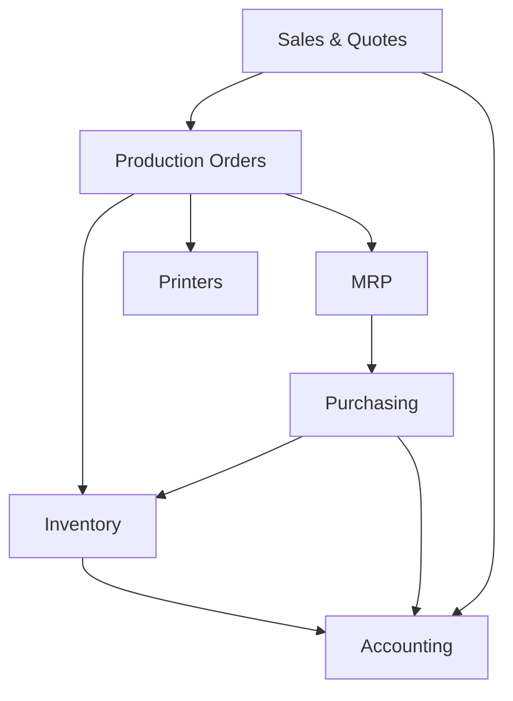

# FilaOps User Guide

Welcome to the FilaOps User Guide. Whether you're setting up for the first time or running a busy print farm, this manual walks you through every part of the system step by step.

## Where to Start

**New to FilaOps?** Follow this path:

1. [Installation & Setup](installation.md) -- Get FilaOps running on your machine
2. [Your First Day](first-day.md) -- Create your admin account, seed sample data, and explore
3. [Understanding the Dashboard](dashboard.md) -- Learn what the home screen is telling you

**Already running?** Jump to the section you need:

## Daily Operations

These are the pages you'll use most. They cover the core work of running a 3D print farm.

| Guide | What You'll Learn |
|-------|-------------------|
| [Managing Your Product Catalog](product-catalog.md) | Create items, set up BOMs, define routings, and organize your product line |
| [Taking and Fulfilling Orders](orders.md) | Handle quotes, sales orders, customers, and the full order lifecycle |
| [Running Production](production.md) | Create production orders, track operations, manage work centers, and record quality |
| [Tracking Inventory](inventory.md) | Monitor stock levels, record transactions, track spools, and run cycle counts |
| [Ordering Supplies](purchasing.md) | Manage vendors, create purchase orders, and receive inventory |
| [Monitoring Your Printers](printers.md) | Connect printers via MQTT, monitor status, and schedule maintenance |

## Planning & Finance

| Guide | What You'll Learn |
|-------|-------------------|
| [Material Planning (MRP)](mrp.md) | Run MRP to detect shortages, generate planned orders, and firm them into real POs or production orders |
| [Basic Accounting](accounting.md) | Review your sales journal, track payments and COGS, and prepare for tax time |

## Administration

| Guide | What You'll Learn |
|-------|-------------------|
| [Users & Permissions](users-and-permissions.md) | Add team members, assign roles, and review security logs |
| [System Settings](system-settings.md) | Configure your company, locations, materials, scrap reasons, and system preferences |

## Workflows & Recipes

These end-to-end guides show how multiple modules work together for common tasks.

| Workflow | Scenario |
|----------|----------|
| [Quote to Cash](workflows/quote-to-cash.md) | From customer inquiry through production to payment |
| [New Product Launch](workflows/new-product-launch.md) | Setting up a new product with BOM, routing, pricing, and initial stock |
| [Weekly Planning Cycle](workflows/weekly-planning.md) | Running MRP, reviewing shortages, and creating purchase orders |
| [Month-End Close](workflows/month-end-close.md) | Reconciling sales, verifying inventory, and closing the books |
| [Onboarding a Printer](workflows/onboarding-a-printer.md) | Adding a new printer to your fleet with MQTT monitoring |

## Reference

| Page | Contents |
|------|----------|
| [First-Run Setup & Password Reset](../FIRST-RUN-SETUP.md) | Setup wizard details, password reset flows, and dev recovery options |
| [Troubleshooting](troubleshooting.md) | Common problems and how to fix them |
| [Glossary](glossary.md) | Definitions of terms used throughout FilaOps |

## How the Modules Connect

Every module in FilaOps feeds data to the others. A sales order can trigger production, which consumes inventory, which MRP detects as a shortage, which generates a purchase order. Accounting records flow automatically from sales, purchasing, and inventory movements.

## Getting Help

- **Issues and feature requests:** [GitHub Issues](https://github.com/Blb3D/filaops/issues)
- **API documentation:** See the [Developer Reference](../reference/index.md) section
- **Contributing:** See `CONTRIBUTING.md` in the repository root

---

*FilaOps v3.5.0 | March 2026*
