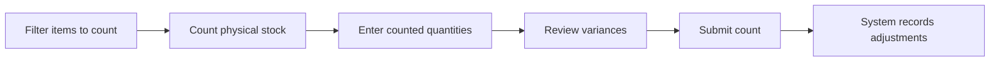

# Tracking Inventory

> Know exactly what you have, where it is, and where it went — every receipt, issue, transfer, and adjustment in one place.

## What You'll Learn

- How to record inventory transactions (receipts, issues, transfers, adjustments)
- How to track filament spools and material usage
- How to run cycle counts to reconcile physical stock with system records
- How to read inventory status indicators

## Prerequisites

- Admin access to FilaOps
- At least one product in your catalog (see [Managing Your Product Catalog](product-catalog.md))
- At least one location set up (see [System Settings](system-settings.md))

---

## Understanding Transaction Types

Every inventory movement in FilaOps is recorded as a transaction. There are six types:

| Type | Color | What It Records |
|------|-------|----|
| **Receipt** | Green | Stock coming in — supplier deliveries, returns from customers, production output |
| **Issue** | Red | Stock going out — shipped to customers, consumed in production |
| **Transfer** | Blue | Stock moving between locations — warehouse to shop floor, shelf to shelf |
| **Adjustment** | Yellow | Corrections — fixing miscounts, reconciling system vs. physical quantity |
| **Consumption** | Orange | Materials used up during production — filament, resin, adhesives |
| **Scrap** | Gray | Damaged, defective, or expired stock being written off |

Each transaction type appears as a colored badge throughout the system, making it easy to scan your transaction history at a glance.

---

## The Inventory Transactions Page

Navigate to **Inventory > Transactions** in the sidebar. This is your main page for recording and reviewing all inventory movements.

<!-- TODO: screenshot of inventory transactions page -->

### Recording a Transaction

**Step 1.** Click **+ New Transaction**.

**Step 2.** Fill in the transaction details:

- **Product** — Select the item (required). Start typing to search by name or SKU.
- **Transaction Type** — Choose from the six types above (defaults to Receipt)
- **Location** — Where this transaction happens (defaults to your primary location)
- **Quantity** — How many units (supports decimals for weight-based items like filament)
- **Cost per Unit** — The unit cost for this transaction (optional — used for costing reports)

**Step 3.** Add optional details:

- **Reference Type** — Link this transaction to a source document:
    - Purchase Order
    - Production Order
    - Sales Order
    - Adjustment (standalone correction)
- **Reference ID** — The specific document number (e.g., PO-1234)
- **Lot Number** — For traceability, if your materials use lot tracking
- **Serial Number** — For serialized items
- **Notes** — Free-text notes about why this transaction happened

**Step 4.** Click **Save**.

!!! info "Transfer transactions"
    When you select **Transfer** as the transaction type, an additional **To Location** field appears. This is required — you must specify both where the stock is coming from (Location) and where it's going (To Location).

!!! info "Adjustment transactions"
    When you select **Adjustment**, an **Adjustment Reason** dropdown appears. Choose a reason that explains the correction — this feeds into your audit trail and accounting records.

### Filtering Transactions

Use the filters above the transaction table to find specific records:

- **Product** — Show transactions for a specific item
- **Type** — Show only receipts, issues, transfers, etc.
- **Location** — Show transactions at a specific warehouse or shop

### Reading the Transaction Table

The transaction table shows these columns:

| Column | What It Shows |
|--------|--------------|
| **Date** | When the transaction was recorded |
| **Product** | Item SKU and name |
| **Type** | Color-coded badge (Receipt, Issue, Transfer, etc.) |
| **Quantity** | Amount with unit of measure |
| **Location** | Where the transaction occurred |
| **Reference** | Linked document type and number (e.g., "Purchase Order #12") |
| **Cost/Unit** | Unit cost at time of transaction |
| **Total Cost** | Quantity multiplied by cost per unit |
| **Notes** | Any notes attached to the transaction |
| **Reason** | Adjustment reason (for adjustment transactions only) |

---

## Material Spools

If you work with filament or other spool-based materials, FilaOps tracks individual spools so you know exactly how much material is left on each one.

Navigate to **Inventory > Spools** in the sidebar.

<!-- TODO: screenshot of spools page -->

### The Spools Page

Each spool in the list shows:

- **Spool Number** — Your identifier for this physical spool
- **Material** — The material name and SKU
- **Weight** — A progress bar showing current weight vs. initial weight, with the exact values displayed
- **Status** — Active, Empty, Expired, or Damaged
- **Location** — Where the spool is stored or in use

### Weight Progress Bar

The weight progress bar is color-coded to give you a quick visual read on remaining material:

| Color | Meaning |
|-------|---------|
| **Green** | More than 20% remaining — plenty of material left |
| **Yellow** | Between 10% and 20% remaining — getting low, plan a replacement |
| **Red** | 10% or less remaining — nearly empty, swap soon |

### Adding a Spool

**Step 1.** Click **+ Add Spool**.

**Step 2.** Fill in the spool details:

- **Spool Number** — A unique identifier (required). Use whatever system works for you — sequential numbers, label codes, etc.
- **Material** — Which material product this spool contains (required). Select from your materials catalog.
- **Initial Weight** — The starting weight in grams (required). For a standard 1kg spool, enter 1000.
- **Current Weight** — How much material is currently on the spool in grams (required). For a brand new spool, this matches the initial weight.
- **Status** — The spool's condition (Active, Empty, Expired, or Damaged)
- **Location** — Where the spool is stored
- **Supplier Lot Number** — The manufacturer's lot or batch number (useful for traceability)
- **Expiry Date** — When the material expires (for hygroscopic materials like nylon)
- **Notes** — Any additional details

**Step 3.** Click **Save**.

!!! tip "Spool Number, Material, and Initial Weight are locked after creation"
    Once you save a spool, you can't change its number, material assignment, or initial weight. You can always update the current weight, status, location, and other fields. If you made a mistake, delete the spool and create a new one.

### Updating Spool Weight

As you use material, update the current weight to keep your progress bars accurate:

**Step 1.** Click **Edit** on the spool you want to update.

**Step 2.** Enter the new **Current Weight** in grams. Weigh the spool on a scale for accuracy.

**Step 3.** Click **Save**.

### Filtering Spools

- **Search** — Find spools by spool number, SKU, or material name
- **Status** — Show only active, empty, expired, or damaged spools

!!! tip "Weigh spools regularly"
    The most common complaint about spool tracking is stale weight data. Make it a habit to weigh active spools at the start of each day or each print run. Accurate weights prevent mid-print runouts and improve your MRP material planning.

---

## Cycle Counts

A cycle count is a physical inventory audit — you count what's actually on the shelf, enter those numbers, and FilaOps calculates and records the variances. This keeps your system quantities aligned with reality.

Navigate to **Inventory > Cycle Count** in the sidebar.

<!-- TODO: screenshot of cycle count page -->

### How Cycle Counts Work

When you submit a cycle count, FilaOps automatically creates inventory adjustment transactions for every item where the counted quantity differs from the system quantity. These adjustments include the reason you selected and create corresponding accounting entries.

### Running a Cycle Count

#### Step 1: Set Up the Count

At the top of the page, configure your count session:

- **Count Reference** — Auto-generated as "Cycle Count YYYY-MM-DD" (today's date). You can edit this to add specifics like "Cycle Count 2026-02-15 — Shelf A".
- **Default Reason** — Select a reason that will apply to all variances in this count (required). You can override the reason on individual items later. Options include:
    - Physical count variance
    - Damaged/defective — scrapped
    - Found in alternate location
    - Data entry error correction
    - Theft/loss suspected
    - Received but not recorded
    - Shipped but not recorded
    - Sample/testing usage
    - Other — see notes

#### Step 2: Filter What to Count

Narrow down which items to include in this count:

- **Location** — Select a specific location, or count across all locations
- **Category** — Filter by product category (e.g., count only filament, or only finished goods)
- **Search** — Find specific items by SKU or name
- **Show zero quantity items** — Toggle this on to include items with zero system quantity (useful for finding unrecorded stock)

#### Step 3: Enter Counted Quantities

The inventory table shows every item matching your filters. For each item you physically counted:

| Column | What It Shows |
|--------|--------------|
| **SKU** | The item's part number |
| **Product Name** | Item name, with category and unit of measure shown below |
| **System Qty** | What FilaOps thinks you have |
| **Counted Qty** | Where you enter the number you actually counted |
| **Variance** | The difference (counted minus system) — shown in green if positive, red if negative |
| **Reason** | Per-item reason override — only appears when there's a variance |

Two shortcut buttons help speed up data entry:

- **Fill Current Qty** — Pre-fills every Counted Qty field with the current System Qty. Then you only need to change the items that differ.
- **Clear All** — Resets all Counted Qty fields to blank.

!!! tip "The \"Fill Current Qty\" shortcut"
    For most cycle counts, the majority of items will match. Click **Fill Current Qty** first, then walk the shelves and only change the items where your count differs. This is much faster than entering every number from scratch.

#### Step 4: Review Variances

As you enter quantities, FilaOps highlights variances in real time:

- Rows with variances get a **yellow background** so they stand out
- The Counted Qty input gets a **yellow border** when it differs from System Qty
- The Variance column shows the difference in **green** (found more than expected) or **red** (found less than expected)

For each item with a variance, you can optionally select a **per-item reason** from the dropdown. If you don't, the default reason from the top of the page is used.

#### Step 5: Submit the Count

When you've finished entering all quantities, click **Submit Count**.

FilaOps processes the count and shows a results summary:

- **Total Items** — How many items were included in the count
- **Successful** (green) — Items processed without errors
- **Failed** (red) — Items that couldn't be processed (rare, usually a system error)

Below the summary, a **variance details table** shows every item that had a variance:

| Column | What It Shows |
|--------|--------------|
| **SKU** | Item part number |
| **Name** | Item name |
| **Previous** | What the system quantity was before the count |
| **Counted** | What you entered |
| **Variance** | The difference |
| **Status** | OK (green) or FAILED (red) |

!!! info "Accounting impact"
    Every cycle count variance creates a journal entry in your general ledger. Positive variances debit Inventory and credit the Inventory Adjustment expense account. Negative variances do the opposite. This keeps your books in sync with physical reality.

### Cycle Count Best Practices

- **Count by area, not all at once** — Use the Location and Category filters to count one section at a time. This is faster and more accurate than trying to count your entire inventory in one session.
- **Count high-value items more often** — Finished goods and expensive materials deserve weekly or monthly counts. Low-value supplies can be counted quarterly.
- **Investigate large variances** — A variance of 1-2 units might be a normal counting error. A variance of 50 units suggests a process problem (unrecorded shipments, theft, data entry mistakes).
- **Use specific reasons** — "Physical count variance" is a catch-all, but specific reasons like "Shipped but not recorded" help you find and fix process gaps.
- **Count during quiet times** — Avoid counting while production is running or orders are being packed. Activity during the count leads to inaccurate results.

---

## Tips & Best Practices

- **Record transactions in real time** — Don't batch up a week's worth of receipts and enter them on Friday. Real-time recording keeps your available quantities accurate for MRP and order fulfillment.
- **Always link to a reference** — When recording a receipt, link it to the purchase order. When recording an issue, link it to the sales order. This creates a complete audit trail.
- **Use lot numbers for traceability** — If a customer reports a quality issue, lot numbers let you trace the problem back to a specific supplier batch.
- **Monitor the Items page stock colors** — The [Items page](product-catalog.md) shows stock status colors (red/orange/yellow/green) at a glance. Check it daily for out-of-stock and low-stock alerts.
- **Weigh spools, don't estimate** — A cheap kitchen scale is your best friend for spool tracking. Guessing leads to mid-print failures.
- **Run cycle counts monthly** — At minimum, count your top 20% of items (by value) every month. This catches variances before they snowball.

## What's Next?

With inventory tracking in place, you can automate replenishment and plan ahead:

- [Ordering Supplies](purchasing.md) — create purchase orders when stock runs low
- [Material Planning (MRP)](mrp.md) — let FilaOps calculate material requirements automatically
- [Running Production](production.md) — track material consumption during manufacturing

## Quick Reference

| Task | Where to Find It |
|------|------------------|
| Record a receipt | **Inventory > Transactions** > **+ New Transaction** > Type: Receipt |
| Record a transfer | **Inventory > Transactions** > **+ New Transaction** > Type: Transfer |
| Record an adjustment | **Inventory > Transactions** > **+ New Transaction** > Type: Adjustment |
| Add a new spool | **Inventory > Spools** > **+ Add Spool** |
| Update spool weight | **Inventory > Spools** > **Edit** on the spool row |
| Run a cycle count | **Inventory > Cycle Count** > Fill quantities > **Submit Count** |
| Filter by location | Use the Location dropdown on any inventory page |
| Check stock levels | **Inventory > Items** > Look at stock status colors |
