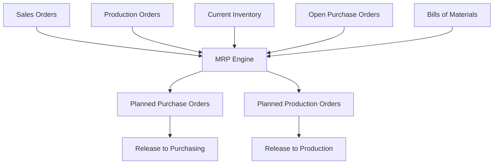
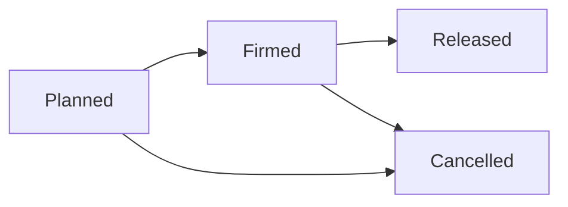

# Material Planning (MRP)

> Stop guessing what to buy and when — let FilaOps calculate material requirements from your open orders and production schedule.

## What You'll Learn

- What MRP does and why it matters for a print farm
- How to run an MRP calculation
- How to read the supply and demand timeline
- How to turn MRP suggestions into actual purchase orders and production orders
- How MRP results flow into the Low Stock tab and order detail views

## Prerequisites

- Admin access to FilaOps
- Products with Bills of Materials defined (see [Managing Your Product Catalog](product-catalog.md))
- Open sales orders or production orders that create demand
- Reorder points and lead times set on your materials (see [Managing Your Product Catalog](product-catalog.md))

---

## What Is MRP?

MRP (Material Requirements Planning) answers three questions:

1. **What do I need?** — Which materials and components are required to fill your open orders
2. **How much?** — The exact quantities, accounting for what's already in stock and what's already on order
3. **When?** — Timing based on lead times and due dates

Without MRP, you're either over-ordering (tying up cash in excess inventory) or under-ordering (stopping production because you ran out of a critical material). MRP finds the balance.

### How FilaOps MRP Works

When you run MRP, FilaOps:

1. **Explodes BOMs** — Looks at every open sales order and production order, then walks through each product's Bill of Materials to calculate the total raw materials needed
2. **Checks current stock** — Subtracts what you already have on hand
3. **Checks incoming supply** — Subtracts quantities already on open purchase orders
4. **Calculates net requirements** — The gap between what you need and what you have or expect to receive
5. **Generates planned orders** — Suggests purchase orders (for bought materials) and production orders (for manufactured sub-assemblies) to fill those gaps

---

## Running MRP

Navigate to **Manufacturing > MRP** in the sidebar and click **Run MRP**.

<!-- TODO: screenshot of MRP page -->

### MRP Parameters

Before running, you can adjust three settings:

| Parameter | Default | What It Controls |
|-----------|---------|-----------------|
| **Planning Horizon** | 30 days | How far into the future to look for demand. A 30-day horizon considers orders due within the next month. |
| **Include Draft Orders** | Off | Whether to include draft sales orders and production orders in the demand calculation. Turn this on if you want to plan for orders that haven't been confirmed yet. |
| **Regenerate Planned Orders** | Off | Whether to delete existing unfirmed planned orders and create fresh ones. Turn this on to start with a clean slate; leave it off to keep any planned orders you've already reviewed. |

Click **Run MRP** to start the calculation. FilaOps processes all open demand, explodes BOMs, and generates results within a few seconds.

---

## Reading MRP Results

After a run completes, you'll see several sections of output.

### Material Requirements Table

The requirements table is the heart of MRP. Each row represents one material or component, with these columns:

| Column | What It Shows |
|--------|--------------|
| **Product** | The material or component name and SKU |
| **Gross Requirement** | Total quantity needed across all open orders |
| **On Hand** | Current inventory quantity |
| **Allocated** | Quantity already committed to other orders |
| **Available** | On hand minus allocated — what's actually free to use |
| **Incoming** | Quantity on open purchase orders that hasn't arrived yet |
| **Safety Stock** | Your minimum buffer quantity (set on the item's reorder point) |
| **Net Shortage** | The gap: gross requirement minus available minus incoming, plus safety stock. A positive number means you need to order. |
| **Lead Time** | How many days it takes to receive this material from your vendor |
| **Reorder Point** | The stock level that triggers a reorder alert |
| **Min Order Qty** | Minimum quantity your vendor will accept per order |

!!! tip "Focus on the Net Shortage column"
    Items with a positive net shortage need action. Items showing zero or negative are covered by existing stock and incoming orders.

### Supply and Demand Timeline

The timeline view shows when supply and demand events occur over your planning horizon — up to 365 days out. This helps you see not just *what* you need, but *when* you need it.

Each timeline entry shows the date, the event type (demand from an order, supply from a PO, or planned order), and the running balance.

### BOM Explosion

The BOM explosion section shows the multi-level breakdown of each finished product into its raw materials. If a product contains sub-assemblies that are themselves manufactured, FilaOps walks through each level until it reaches purchased materials.

This is useful for understanding *why* MRP is requesting certain quantities — you can trace the demand back through the BOM hierarchy to the original sales order.

---

## Planned Orders

MRP doesn't create actual purchase orders or production orders directly. Instead, it creates **planned orders** — suggestions that you review and approve before they become real.

### Types of Planned Orders

| Type | When Created | What It Becomes |
|------|-------------|----------------|
| **Planned Purchase Order** | When a bought material has a net shortage | A real purchase order sent to a vendor |
| **Planned Production Order** | When a manufactured sub-assembly has a net shortage | A real production order on the shop floor |

### Planned Order Lifecycle

- **Planned** — MRP's suggestion. These are automatically updated or deleted when you re-run MRP (unless you've firmed them).
- **Firmed** — You've reviewed and locked this planned order. MRP will not modify or delete firmed orders on subsequent runs.
- **Released** — Converted into an actual purchase order or production order. The planned order is closed.
- **Cancelled** — You've decided this order isn't needed.

### Working with Planned Orders

#### Reviewing Planned Orders

After running MRP, review the list of planned orders. Each shows the material, suggested quantity, type (purchase or production), and the demand source that triggered it.

#### Firming a Planned Order

When you've reviewed a planned order and agree with MRP's suggestion:

**Step 1.** Select the planned order.

**Step 2.** Click **Firm**.

This locks the order so the next MRP run won't change or delete it. Firm orders when you're confident in the quantity and timing but aren't ready to release yet.

#### Releasing a Planned Order

When you're ready to act on a firmed planned order:

**Step 1.** Select the planned order.

**Step 2.** Click **Release**.

**Step 3.** For planned purchase orders, select the **vendor** to order from.

**Step 4.** Confirm the release.

FilaOps creates the actual purchase order or production order and closes the planned order. The new order appears in **Purchasing** or **Manufacturing > Production** respectively.

#### Cancelling a Planned Order

If a planned order is no longer needed (perhaps the sales order was cancelled):

**Step 1.** Select the planned order.

**Step 2.** Click **Cancel**.

---

## MRP in Your Daily Workflow

MRP results don't just live on the MRP page — they flow into other parts of FilaOps to help you take action.

### The Low Stock Tab

Navigate to **Purchasing > Low Stock**. Each item shows a **Shortage Source** column indicating where the alert came from:

| Source | Meaning |
|--------|---------|
| **Reorder Point** | Stock dropped below the reorder level you set on the item |
| **MRP** | The MRP engine calculated a future shortage based on open orders |
| **Both** | Flagged by both the reorder point and MRP |

Items sourced from MRP include the calculated shortage quantity, making it easy to create purchase orders for the right amounts.

### Order Detail Views

When viewing a sales order or production order, the detail view shows whether MRP has identified any material shortages for that specific order. This helps you prioritize which orders to fulfill first based on material availability.

### Dashboard Alerts

The main dashboard surfaces MRP-related alerts when materials are critically short, so you don't have to check the MRP page separately.

---

## Tips & Best Practices

- **Run MRP weekly** — At minimum, run MRP every Monday as part of your [Weekly Planning Cycle](workflows/weekly-planning.md). If your order volume is high, run it daily.
- **Set accurate lead times** — MRP's timing suggestions are only as good as your lead time data. Update lead times whenever you notice a vendor consistently delivering faster or slower than expected.
- **Keep reorder points current** — Reorder points act as safety stock. Set them based on your typical usage rate and how long you can wait for a delivery.
- **Firm before you release** — Don't skip the firming step. It protects your reviewed orders from being overwritten by the next MRP run.
- **Use "Include Draft Orders" for planning ahead** — If you have large quotes likely to convert, include draft orders in MRP so you can pre-order materials before the rush.
- **Clean up old planned orders** — Cancel planned orders that are no longer relevant. Stale planned orders clutter your view and may confuse future MRP runs.
- **Trust the BOM explosion** — If MRP is suggesting unexpected quantities, check the BOM explosion view to trace the demand. The issue is usually a BOM error (wrong quantity per assembly) rather than an MRP bug.

## What's Next?

With MRP calculating your material needs, connect it to the rest of your workflow:

- [Ordering Supplies](purchasing.md) — release planned purchase orders into actual POs
- [Running Production](production.md) — release planned production orders to the shop floor
- [Tracking Inventory](inventory.md) — keep stock levels accurate so MRP has good data
- [Managing Your Product Catalog](product-catalog.md) — maintain accurate BOMs and lead times

## Quick Reference

| Task | Where to Find It |
|------|--------------------|
| Run MRP | **Manufacturing > MRP** > **Run MRP** |
| Set planning horizon | **Manufacturing > MRP** > Planning Horizon parameter |
| View material requirements | **Manufacturing > MRP** > Requirements table after a run |
| View supply/demand timeline | **Manufacturing > MRP** > Timeline section after a run |
| View BOM explosion | **Manufacturing > MRP** > BOM Explosion section after a run |
| Review planned orders | **Manufacturing > MRP** > Planned Orders list |
| Firm a planned order | Planned order > **Firm** |
| Release a planned order | Planned order > **Release** |
| Check MRP-sourced low stock | **Purchasing > Low Stock** tab > Look for "MRP" shortage source |
