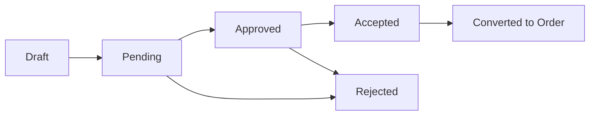
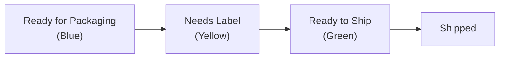
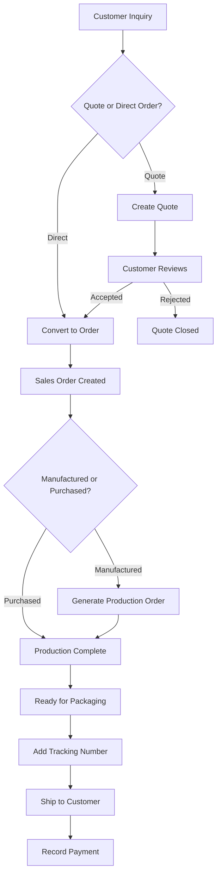

# Taking and Fulfilling Orders

> From first contact to final delivery — manage your entire sales pipeline in one place.

## What You'll Learn

- How to manage customers and import them from CSV
- How to create quotes and convert them into sales orders
- How to create sales orders directly using the order wizard
- How to track fulfillment status and ship orders
- How to record payments and track outstanding balances

## Prerequisites

- Admin access to FilaOps
- At least one product in your catalog (see [Managing Your Product Catalog](product-catalog.md))
- At least one location set up (see [System Settings](system-settings.md))

---

## Managing Customers

Before you can take orders, you need customers. Navigate to **Admin > Customers** in the sidebar.

<!-- TODO: screenshot of customers page -->

### The Customers Page

The page shows four stat cards at the top:

| Stat | What It Shows |
|------|--------------|
| **Total Customers** | Total number of customer records |
| **Active** | Customers with active status |
| **With Orders** | Customers who have placed at least one order |
| **Total Revenue** | Sum of all customer spending |

Below the stats, you'll find a search bar and status filter dropdown, followed by a table of all customers.

### Creating a Customer

**Step 1.** Click **+ Add Customer**.

**Step 2.** Fill in the customer details:

- **Email** — Required. Used for communication and as a unique identifier.
- **First Name / Last Name** — The customer's name
- **Company Name** — Optional, for business customers
- **Customer Number** — Your internal customer ID (optional but recommended)
- **Phone** — Contact phone number
- **Address** — Shipping and billing address fields
- **Status** — Active, Inactive, or Suspended

**Step 3.** Click **Save**.

!!! tip "Quick customer creation from orders"
    If you're in the middle of creating an order and realize the customer doesn't exist yet, the order wizard has a shortcut. It will send you to the Customers page with the new customer form pre-opened, and once you save, it returns you to the order wizard with the new customer selected.

### Importing Customers from CSV

If you have an existing customer list in a spreadsheet, you can bulk import it.

**Step 1.** Click **Import CSV**.

**Step 2.** Upload your CSV file. The file should have columns for email, name, company, and other customer fields.

**Step 3.** Map your CSV columns to FilaOps fields and review the preview.

**Step 4.** Click **Import** to create all customer records at once.

### Viewing Customer Details

Click **View** on any customer row to see their full profile, including:

- Contact information and address
- Order history and total spending
- Status and account details

Click **Edit** to modify any customer's details.

### Filtering Customers

Use the **search bar** to find customers by email, name, company, or customer number. Use the **status dropdown** to show only active, inactive, or suspended customers.

---

## Creating and Managing Quotes

Quotes let you propose pricing to a customer before committing to a sales order. Navigate to **Sales > Quotes** in the sidebar.

<!-- TODO: screenshot of quotes page -->

### The Quotes Page

Six stat cards across the top give you a snapshot of your quoting activity:

| Stat | What It Shows |
|------|--------------|
| **Pending** | Quotes waiting for review, with total dollar value |
| **Approved** | Quotes you've approved — ready for the customer to accept |
| **Accepted** | Quotes the customer has accepted — ready to convert to orders |
| **Converted** | Quotes that have become sales orders |
| **Conversion Rate** | Percentage of quotes that become orders |
| **Total Value** | Total dollar value across all quotes |

!!! tip "Click the stat cards"
    Each stat card acts as a quick filter. Click **Pending** to see only pending quotes, click **Accepted** to see quotes ready to convert, and so on.

### Quote Lifecycle

Quotes move through a series of statuses:

- **Pending** — The quote has been created and is awaiting your review
- **Approved** — You've approved the pricing; it's ready for the customer
- **Accepted** — The customer has accepted the quote
- **Converted** — The quote has been turned into a sales order
- **Rejected** — The quote was declined (by you or the customer)

### Creating a Quote

**Step 1.** Click **+ New Quote**.

**Step 2.** Fill in the quote details:

- **Customer** — Select an existing customer
- **Product** — The item being quoted
- **Quantity** — How many units
- **Unit Price** — Your proposed price per unit
- **Expiration Date** — When the quote expires (optional but recommended)
- **Notes** — Any special terms or conditions

**Step 3.** Click **Save**.

### Working with Quotes

From the quotes table, each quote has action buttons depending on its status:

| Status | Available Actions |
|--------|------------------|
| **Any status** | Download PDF, Print, Duplicate, Delete |
| **Pending** | Approve |
| **Approved / Accepted** | Convert to Order |

### Quote Expiry Tracking

FilaOps tracks quote expiration dates and shows visual warnings:

- **Red badge** — The quote has expired
- **Yellow badge** — The quote expires within 7 days (shows "X days left")
- **Normal date** — The quote has time remaining

!!! warning "Expired quotes can't be converted"
    Once a quote expires, you cannot convert it to a sales order. Duplicate the quote with updated dates if the customer wants to proceed.

### Converting a Quote to an Order

When a customer accepts a quote:

**Step 1.** Find the quote in the list (use the **Accepted** stat card to filter).

**Step 2.** Click the **Convert to Order** button.

**Step 3.** FilaOps creates a new sales order with all the details from the quote and navigates you to it.

### Duplicating a Quote

Click **Duplicate** to create a copy of any quote. The duplicate copies all fields and adds a note referencing the original quote number. This is useful for creating variations or renewing expired quotes.

### Downloading and Printing Quotes

Every quote has **Download PDF** and **Print** buttons. Use these to share professional-looking quotes with customers via email or in person.

---

## Creating Sales Orders

Sales orders are the core of your fulfillment workflow. Navigate to **Sales > Orders** in the sidebar.

<!-- TODO: screenshot of orders page -->

### The Orders Page

Orders display in a **card grid** layout (not a traditional table). Each card shows the order number, customer, products, total value, date, and fulfillment status at a glance.

At the top, you'll find:

- **Search** — Find orders by order number, product name, customer name, or email
- **Fulfillment filters** — Quick-filter buttons to show orders by fulfillment state
- **Sort dropdown** — Control the order of results

### Fulfillment Filters

Color-coded filter buttons let you focus on what needs attention:

| Filter | Color | What It Shows |
|--------|-------|--------------|
| **All** | Blue | Every order |
| **Ready to Ship** | Green | All items produced and available — ready to pack and ship |
| **Partially Ready** | Yellow | Some items ready, others still in production or out of stock |
| **Blocked** | Red | Cannot be fulfilled — missing inventory or production not started |
| **Shipped** | Gray | Already shipped to the customer |

### Sort Options

| Sort | What It Does |
|------|-------------|
| **Most Actionable First** | Orders you can act on right now appear first (default) |
| **Newest / Oldest First** | Sort by order date |
| **Most / Least Complete First** | Sort by fulfillment percentage |
| **Customer A-Z** | Alphabetical by customer name |
| **Highest Value First** | Largest dollar orders first |

### Creating an Order with the Wizard

**Step 1.** Click **Create Order** to open the Sales Order Wizard.

The wizard walks you through three steps:

#### Step 1: Select Customer

Choose an existing customer from the dropdown, or click **Create New Customer** to add one on the fly.

<!-- TODO: screenshot of customer selection step -->

#### Step 2: Add Products

Add line items to the order. For each line:

- **Product** — Select from your catalog (Finished Goods, Components, Supplies, or Services)
- **Quantity** — How many units
- **Unit Price** — Price per unit (defaults to the item's selling price)

If a product doesn't exist yet, you can create one inline using the **item wizard** — a 3-sub-step form covering basic details, BOM (if manufactured), and pricing.

Each line item has a procurement type that determines how it will be fulfilled:

| Type | Meaning |
|------|---------|
| **Manufactured** | Needs to be produced — requires a BOM |
| **Purchased** | Bought from a supplier |
| **Flexible** | Can be either manufactured or purchased |

<!-- TODO: screenshot of product selection step -->

#### Step 3: Review and Submit

Review the complete order:

- Customer details and shipping address
- All line items with quantities and prices
- Order total and any notes

Add **customer notes** (visible to the customer) or **admin notes** (internal only).

Click **Submit Order** to create it.

### Viewing Order Details

Click any order card to open the detail view, which shows:

- **Order header** — Order number, date, status, and source
- **Customer info** — Name, email, and shipping address
- **Line items** — Each product with quantity, unit price, and line total
- **Grand total** — The complete order value

### Generating a Production Order

For manufactured items, you can create production orders directly from a sales order:

**Step 1.** Open the order detail view.

**Step 2.** Click **Generate Production Order**.

**Step 3.** FilaOps creates a production order linked to the BOM for each manufactured line item, with the quantity from the sales order.

This connects your sales pipeline directly to the shop floor. See [Running Production](production.md) for the full production workflow.

### Canceling an Order

If an order needs to be canceled:

**Step 1.** Open the order detail view.

**Step 2.** Click **Cancel Order**.

**Step 3.** Enter a cancellation reason (required, up to 500 characters) explaining why the order is being canceled.

**Step 4.** Confirm the cancellation.

!!! warning "Canceling is permanent"
    Canceled orders cannot be reopened. If the customer changes their mind, you'll need to create a new order.

---

## Shipping Orders

Once production is complete and items are ready, navigate to **Sales > Shipping** to manage the shipping workflow.

<!-- TODO: screenshot of shipping page -->

### Shipping Dashboard

At the top of the page, a **shipping chart** shows your shipping activity over time. Toggle between time periods:

- **WTD** — Week to date
- **MTD** — Month to date
- **QTD** — Quarter to date
- **YTD** — Year to date

The chart shows daily shipped quantities as bars and cumulative value as a line, plus a pipeline count of orders still in progress.

### The Three-Tab Workflow

Shipping uses a three-tab workflow that guides orders from production through delivery:

#### Tab 1: Ready for Packaging (Blue)

Orders where production is **not yet complete**. These are in the pipeline but not ready to pack. Monitor these to track what's coming.

#### Tab 2: Needs Label (Yellow)

Orders where production is **complete** but no tracking number has been entered yet. These need carrier and tracking information.

**To add tracking:**

**Step 1.** Click on an order in this tab.

**Step 2.** Select the **Carrier** from the dropdown (USPS is the default).

**Step 3.** Enter the **Tracking Number**.

**Step 4.** Click **Save** to move the order to the Ready to Ship tab.

#### Tab 3: Ready to Ship (Green)

Orders that have tracking numbers and are ready to go out the door.

**To mark as shipped:**

Click **Mark Shipped** to update the order status. This moves it to the Shipped filter on the main Orders page.

### Due Date Urgency

Each order card in the shipping tabs shows a due date indicator:

| Indicator | Meaning |
|-----------|---------|
| **Red "Overdue"** | Past the promised delivery date |
| **Orange "Due Today"** | Needs to ship today |
| **Yellow "Due Soon"** | Due within the next 2 days |
| **Normal date** | Has time remaining |

### Packing Slips

Click **Packing Slip** on any order to generate a printable packing slip PDF. This opens in a new tab for printing.

---

## Recording Payments

Track payments against your sales orders. Navigate to **Sales > Payments** in the sidebar.

<!-- TODO: screenshot of payments page -->

### Payment Dashboard

The payments page shows key performance indicators at the top, including total received, outstanding balances, and payment trends.

### Recording a Payment

**Step 1.** Click **Record Payment**.

**Step 2.** Fill in the payment details:

- **Order** — Which sales order this payment applies to
- **Amount** — How much was received
- **Payment Method** — Choose from:
    - Cash
    - Check
    - Credit Card
    - PayPal
    - Stripe
    - Venmo
    - Zelle
    - Wire Transfer
    - Other
- **Reference Number** — Check number, transaction ID, etc.
- **Notes** — Any additional details

**Step 3.** Click **Save**.

### Recording a Refund

The process is similar to recording a payment, but select **Refund** as the payment type. Refunds reduce the amount collected against an order.

### Filtering Payment History

Use the filters to narrow down your payment records:

- **Search** — Find by order number, customer, or reference
- **Payment Method** — Show only a specific payment type
- **Payment Type** — Filter between payments and refunds
- **Date Range** — Set start and end dates to view a specific period

---

## The Full Order Lifecycle

Here's how all the pieces fit together, from first contact to cash in hand:

For a detailed walkthrough of this end-to-end process, see the [Quote to Cash](workflows/quote-to-cash.md) workflow guide.

---

---

## Editing Order Lines

Admins can edit line quantities and remove lines on orders in **pending**, **confirmed**, **in_production**, or **on_hold** status.

### Changing a Quantity

1. Open the order detail view
2. In the **Line Items** table, click **Edit** on the line
3. Enter the new quantity (cannot go below already-shipped amount)
4. Enter a reason — this is recorded in the order history
5. Click ✓ to save

### Removing a Line

A **✕** button appears next to each line when:

- The order has more than one line
- The line has not been shipped
- No non-cancelled production orders are linked to that line (including completed or closed POs)

Click **✕** → confirm the prompt → the line is removed and totals recalculate automatically.

> **Note**: If any non-cancelled production order (including completed or closed states) exists for the line, cancel it first before removing the line.

---

## Close-Short Workflow

Close-short lets you accept partial fulfillment when the full ordered quantity cannot be produced or shipped. This closes the order without waiting indefinitely for the remaining units.

### When to Use

- A production order completed with fewer units than ordered (scrap, material shortage)
- Customer agreed to accept partial shipment
- You want to close out an order rather than leave it open

### How It Works

1. Open the order detail — you'll see a **Close Short** button when the order is in `confirmed`, `in_production`, or `ready_to_ship` status
2. Click **Close Short** → a preview modal shows per-line achievable quantities based on completed production
3. Review the breakdown — lines that can't be fully fulfilled are flagged
4. Confirm → FilaOps adjusts line quantities to what was actually fulfilled, marks the order closed-short, and updates fulfillment status

> **Tip**: Use **PO Accept-Short** on linked production orders first to lock in completed quantities, then use Close-Short on the sales order.

---

## Tips & Best Practices

- **Use quotes for custom work** — Quotes give customers time to review pricing and let you track conversion rates
- **Set expiration dates on quotes** — This creates urgency and keeps your pipeline clean
- **Sort by "Most Actionable First"** — The default sort puts orders you can act on right now at the top of the list
- **Check the Blocked filter daily** — Red-flagged orders need attention: missing materials, incomplete production, or other issues
- **Record payments promptly** — This keeps your outstanding balance reports accurate
- **Use the shipping tabs in order** — The Ready for Packaging → Needs Label → Ready to Ship flow prevents missed steps
- **Add cancellation reasons** — They help you identify patterns (pricing issues, lead time, competitor loss) to improve your process

## What's Next?

With orders flowing, you'll want to manage the production and delivery side:

- [Running Production](production.md) — manufacture items from your sales orders
- [Tracking Inventory](inventory.md) — keep stock levels accurate
- [Ordering Supplies](purchasing.md) — make sure you have materials on hand

## Quick Reference

| Task | Where to Find It |
|------|------------------|
| Create a customer | **Admin > Customers** > **+ Add Customer** |
| Import customers from CSV | **Admin > Customers** > **Import CSV** |
| Create a quote | **Sales > Quotes** > **+ New Quote** |
| Convert a quote to an order | **Sales > Quotes** > **Convert to Order** button |
| Download a quote PDF | **Sales > Quotes** > **Download PDF** button |
| Create a sales order | **Sales > Orders** > **Create Order** |
| View order details | **Sales > Orders** > Click an order card |
| Generate a production order | Order detail view > **Generate Production Order** |
| Cancel an order | Order detail view > **Cancel Order** |
| Edit a line quantity | Order detail view > Line Items table > **Edit** |
| Remove a line | Order detail view > Line Items table > **✕** |
| Close an order short | Order detail view > **Close Short** |
| Add a tracking number | **Sales > Shipping** > **Needs Label** tab > Enter tracking |
| Mark an order as shipped | **Sales > Shipping** > **Ready to Ship** tab > **Mark Shipped** |
| Print a packing slip | **Sales > Shipping** > **Packing Slip** button |
| Record a payment | **Sales > Payments** > **Record Payment** |
| Record a refund | **Sales > Payments** > **Record Payment** (Refund type) |
