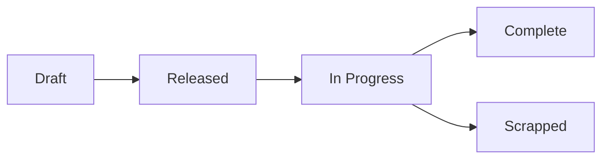

# Running Production

> Turn sales orders into finished goods — schedule, track, and complete production runs across your shop floor.

## What You'll Learn

- How to set up work centers and routings for your manufacturing process
- How to create and manage production orders
- How to track production progress and complete orders
- How to handle scrap, splits, and quality inspections
- How to read the production dashboard

## Prerequisites

- Admin access to FilaOps
- At least one product with a Bill of Materials (see [Managing Your Product Catalog](product-catalog.md))
- At least one printer or work center configured

---

## Setting Up Manufacturing

Before you can run production, you need to tell FilaOps about your equipment and processes. Navigate to **Manufacturing > Setup** in the sidebar.

<!-- TODO: screenshot of manufacturing setup page -->

### Work Centers

A work center is a logical grouping of machines or workstations — for example, "FDM Print Farm," "Resin Station," or "Post-Processing Bench."

#### Creating a Work Center

**Step 1.** Click **+ Add Work Center**.

**Step 2.** Fill in the work center details:

- **Name** — A descriptive name (e.g., "FDM Print Farm")
- **Description** — What this work center handles
- **Capacity** — How many jobs can run simultaneously

**Step 3.** Click **Save**.

#### Adding Resources to a Work Center

Resources are the individual machines or stations within a work center — each printer, each curing station, etc.

**Step 1.** Open a work center card and click **Add Resource**.

**Step 2.** Fill in the resource details:

- **Name** — The specific machine name (e.g., "Prusa MK4 #3")
- **Type** — What kind of resource this is
- **Status** — Whether it's available, in maintenance, etc.

**Step 3.** Click **Save**.

!!! tip "Quick printer setup"
    Click the **Printer Setup** button (purple) at the top of the Work Centers tab to use the guided wizard. This walks you through creating a work center and adding your printer as a resource in one step — much faster than doing it manually.

#### Editing and Removing Resources

- Click **Edit** on any resource to update its details
- Click **Delete** to permanently remove a resource (you'll be asked to confirm)

!!! warning "Deleting resources is permanent"
    Unlike work centers (which are deactivated), deleting a resource removes it entirely. Make sure no active production orders depend on it.

### Routings

A routing defines the step-by-step process for manufacturing a product — which operations to perform, in what order, and how long each takes.

Navigate to the **Routings** tab on the Manufacturing Setup page.

<!-- TODO: screenshot of routings tab -->

#### The Routings Table

The table shows all your routings with these columns:

| Column | What It Shows |
|--------|--------------|
| **Code** | The routing identifier (with a "Template" badge for template routings) |
| **Product** | Which product this routing produces |
| **Version** | Version number and revision (e.g., "v2 rev 3") |
| **Operations** | Number of steps in the routing |
| **Total Time** | Combined run time across all operations (in minutes) |
| **Cost** | Calculated manufacturing cost |
| **Status** | Active or Inactive |

#### Creating a Routing

**Step 1.** Click **+ New Routing** to open the Routing Editor.

**Step 2.** Fill in the routing header:

- **Code** — A unique identifier for this routing
- **Product** — Which product this routing manufactures
- **Version** — Version number for tracking changes

**Step 3.** Add operations in sequence. Each operation specifies:

- **Operation name** — What this step is called (e.g., "Print," "Support Removal," "Assembly")
- **Work center** — Which work center handles this step
- **Setup time** — Time to prepare the machine (in minutes)
- **Run time** — Time per unit produced (in minutes)

**Step 4.** Click **Save**.

#### Routing Templates

Mark a routing as a **template** to reuse it as a starting point for new products. Template routings appear with a green highlight and a "Template" badge in the list. When creating a new routing, you can base it on an existing template instead of starting from scratch.

---

## The Production Page

Navigate to **Manufacturing > Production** in the sidebar. This is your primary workspace for managing production orders.

<!-- TODO: screenshot of production page -->

### Production Chart

At the top of the page, a trend chart shows your production throughput over time. Toggle between time periods:

- **WTD** — Week to date
- **MTD** — Month to date
- **QTD** — Quarter to date
- **YTD** — Year to date

The chart displays:

- **Purple bars** — Units completed each day
- **Green line** — Cumulative units produced over the period
- **Pipeline count** — Number of orders currently in progress or scheduled

### Stats Cards

Six stat cards give you a snapshot of current production activity:

| Card | Color | What It Shows |
|------|-------|--------------
| **Draft** | Gray | Orders created but not yet released to the floor |
| **Released** | Blue | Orders released and ready to start |
| **In Progress** | Purple | Orders currently being worked on |
| **Completed Today** | Green | Orders finished today |
| **Scrapped Today** | Red | Orders scrapped today |
| **Total Active** | White | Sum of released + in progress orders |

### Filtering and Searching

Use the filters to focus on what needs attention:

- **Search** — Find orders by production order code, product name, or linked sales order code
- **Status filter** — Show only orders in a specific status (defaults to "In Progress")

### Make-to-Order vs. Make-to-Stock

Each production order shows a badge indicating its source:

| Badge | Color | Meaning |
|-------|-------|---------
| **SO-1234** | Blue | Make-to-order — linked to a specific sales order |
| **STOCK** | Purple | Make-to-stock — building inventory, not tied to a sales order |

---

## Production Order Lifecycle

Production orders move through a series of statuses:

- **Draft** — The order has been created but isn't ready for the floor yet. Use this for planning ahead.
- **Released** — The order is approved and ready to start. Materials should be available.
- **In Progress** — Work has begun. Printers are running, assembly is underway.
- **Complete** — All units have been produced and the order is closed.
- **Scrapped** — The order was abandoned due to defects, material issues, or other problems.

---

## Creating a Production Order

### From the Production Page

**Step 1.** Click **+ New Production Order**.

**Step 2.** Fill in the order details:

- **Product** — Select the item to produce (must have a BOM defined)
- **Quantity** — How many units to produce (minimum 1)
- **Priority** — How urgent this order is:

| Priority | Level |
|----------|-------|
| **1** | Urgent |
| **2** | High |
| **3** | Normal (default) |
| **4** | Low |
| **5** | Lowest |

- **Due Date** — When the order needs to be complete (optional, must be today or later)
- **Notes** — Any special instructions for the production team

**Step 3.** Click **Create**.

The new order starts in **Draft** status.

### From a Sales Order

You can also generate production orders directly from a sales order:

**Step 1.** Open a sales order in **Sales > Orders**.

**Step 2.** Click **Generate Production Order**.

**Step 3.** FilaOps creates production orders for each manufactured line item, pre-filled with the product, quantity, and a link back to the sales order.

This is the recommended workflow for make-to-order production. The linked sales order code appears as a blue badge on the production order, so you always know which customer it's for.

---

## Working with Production Orders

### Viewing Order Details

Click any production order in the list to open its detail view. This shows:

- Order code and status
- Product being manufactured
- Quantity ordered vs. quantity completed
- Priority and due date
- Linked sales order (if make-to-order)
- Notes and scheduling information

### Releasing an Order

When a draft order is ready for the floor:

**Step 1.** Open the production order.

**Step 2.** Click **Release**.

This changes the status to **Released**, signaling your team that materials are available and work can begin.

### Starting Production

When work begins on a released order:

**Step 1.** Open the production order.

**Step 2.** Click **Start** to move it to **In Progress**.

### Completing a Production Order

When all units are finished:

**Step 1.** Open the production order.

**Step 2.** Click **Complete**.

**Step 3.** Enter the **quantity completed** — this may differ from the quantity ordered if some units failed.

**Step 4.** Confirm the completion.

Completed inventory is added to your stock automatically.

### Splitting a Production Order

If you need to produce part of an order on a different timeline or machine:

**Step 1.** Open the production order.

**Step 2.** Click **Split Order**.

**Step 3.** Enter the quantity to split off into a new order.

**Step 4.** Confirm the split.

FilaOps creates a new production order with the split quantity and reduces the original order accordingly. Both orders maintain the link to the original sales order (if applicable).

!!! tip "When to split"
    Splitting is useful when a printer breaks mid-run and you need to finish the remaining units on a different machine, or when you want to prioritize part of a large batch.

### Scrapping a Production Order

If a production run fails and cannot be completed:

**Step 1.** Open the production order.

**Step 2.** Click **Scrap**.

**Step 3.** Select a **scrap reason** explaining what went wrong (e.g., "Print failure," "Material defect," "Design error").

**Step 4.** Confirm the scrap.

Scrapped orders are tracked separately in your production stats so you can identify recurring issues.

### Quality Control Inspection

For orders that need quality verification before being marked complete:

**Step 1.** Open the production order.

**Step 2.** Click **QC Inspection**.

**Step 3.** Record the inspection results — pass/fail for each unit or batch.

**Step 4.** Save the inspection.

Units that pass QC move toward completion. Units that fail can be scrapped or flagged for rework.

---

## The Production Queue

The main production list shows all orders organized by status. By default, you see **In Progress** orders first — these are the ones that need your attention right now.

Each order card in the queue shows:

- **Order code** — The production order number
- **Product name** — What's being produced
- **Quantity** — Ordered vs. completed
- **Priority** — Color-coded urgency level
- **Due date** — When it needs to be done
- **Sales order link** — Blue badge for make-to-order, purple "STOCK" for make-to-stock
- **Status** — Current production stage

---

## Tips & Best Practices

- **Set up work centers before creating production orders** — this lets you assign work to specific machines and track capacity
- **Use routings for repeatable products** — they save time and ensure consistency across production runs
- **Create routing templates** — if you have a standard process (e.g., "Print → Clean → Cure"), save it as a template and reuse it
- **Generate production orders from sales orders** — this ensures the link between what the customer ordered and what you're producing
- **Check the Production Chart daily** — the trend line helps you spot throughput drops before they become backlogs
- **Use priority levels** — urgent customer orders should be priority 1-2; stock replenishment can be 4-5
- **Record scrap reasons consistently** — over time, this data reveals patterns (specific printers failing, certain materials problematic) that help you improve quality
- **Split orders when needed** — don't let a partial failure hold up the entire batch

## What's Next?

With production running, you'll need to manage the materials and inventory side:

- [Tracking Inventory](inventory.md) — monitor stock levels and record transactions
- [Ordering Supplies](purchasing.md) — purchase materials before you run out
- [Material Planning (MRP)](mrp.md) — let FilaOps calculate what you need and when

## Quick Reference

| Task | Where to Find It |
|------|-----------------|
| Set up a work center | **Manufacturing > Setup** > **Work Centers** tab > **+ Add Work Center** |
| Quick-add a printer | **Manufacturing > Setup** > **Printer Setup** button |
| Add a resource to a work center | Work center card > **Add Resource** |
| Create a routing | **Manufacturing > Setup** > **Routings** tab > **+ New Routing** |
| Create a production order | **Manufacturing > Production** > **+ New Production Order** |
| Generate from a sales order | **Sales > Orders** > Order detail > **Generate Production Order** |
| Release an order to the floor | Production order detail > **Release** |
| Complete a production order | Production order detail > **Complete** |
| Split a production order | Production order detail > **Split Order** |
| Scrap a production order | Production order detail > **Scrap** |
| Run a QC inspection | Production order detail > **QC Inspection** |
| View production trends | **Manufacturing > Production** > Chart at top of page |
