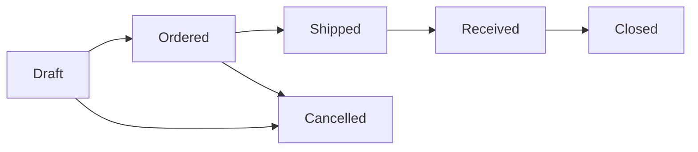

# Ordering Supplies

> Keep your shelves stocked — manage vendors, create purchase orders, and receive deliveries without losing track of a single spool.

## What You'll Learn

- How to set up and manage vendors
- How to create purchase orders manually and from low-stock alerts
- How to track purchase order status from draft to received
- How to receive deliveries and update inventory automatically
- How to use the Low Stock tab to stay ahead of shortages

## Prerequisites

- Admin access to FilaOps
- At least one product in your catalog (see [Managing Your Product Catalog](product-catalog.md))
- At least one location set up (see [System Settings](system-settings.md))

---

## The Purchasing Page

Navigate to **Purchasing** in the sidebar. The page has four tabs across the top:

- **Purchase Orders** — Create and manage POs
- **Vendors** — Your supplier directory
- **Import** — Bulk import tools
- **Low Stock** — Items below their reorder point, ready for quick PO creation

A **Purchasing Trend Chart** at the top shows your purchasing activity over time. Toggle between time periods: **WTD** (week to date), **MTD** (month to date), **QTD** (quarter to date), or **YTD** (year to date).

<!-- TODO: screenshot of purchasing page -->

---

## Managing Vendors

Before creating purchase orders, set up your suppliers. Click the **Vendors** tab.

<!-- TODO: screenshot of vendors tab -->

### Creating a Vendor

**Step 1.** Click **+ New Vendor**.

**Step 2.** Fill in the vendor details:

- **Vendor Name** — The company name (required)
- **Vendor Code** — Your internal shorthand (e.g., "POLY" for Polymaker)
- **Contact Name** — Your primary contact person
- **Email** — Contact email
- **Phone** — Contact phone number
- **Address** — Vendor's address
- **Website** — Vendor's website URL
- **Notes** — Payment terms, minimum order quantities, or other important details

**Step 3.** Click **Save**.

### Viewing Vendor Details

Click any vendor row to open the **Vendor Detail Panel**. This shows the vendor's full contact information and gives you a shortcut to create a purchase order directly from the vendor profile — click **Create PO** to start a new order pre-filled with this vendor.

### Finding Vendors

Use the **search bar** to find vendors by name, code, or contact information.

---

## Purchase Order Lifecycle

Purchase orders move through a series of statuses:

- **Draft** — The PO has been created but not yet sent to the vendor. Use this to prepare orders and get approval before committing.
- **Ordered** — The PO has been sent to the vendor. You're waiting for delivery.
- **Shipped** — The vendor has shipped the goods. You're waiting for them to arrive.
- **Received** — The delivery has arrived and been checked in. Inventory is updated.
- **Closed** — The PO is complete. All items received and accounted for.
- **Cancelled** — The PO was abandoned before completion.

---

## Creating a Purchase Order

Click the **Purchase Orders** tab, then click **+ New PO**.

<!-- TODO: screenshot of PO creation modal -->

### Filling in the PO

**Step 1.** Select the **Vendor** from the dropdown.

**Step 2.** Add line items — for each item you're ordering:

- **Product** — Select from your catalog
- **Quantity** — How many units to order
- **Unit Cost** — The price per unit from this vendor

**Step 3.** Add optional details:

- **Expected Delivery Date** — When you expect the shipment to arrive
- **Notes** — Special instructions for the vendor or internal notes

**Step 4.** Click **Save** to create the PO in Draft status.

### Other Ways to Create POs

You don't always have to start from scratch. FilaOps lets you create purchase orders from several places:

| Source | How |
|--------|-----|
| **Low Stock tab** | Check items below reorder point and click to create a PO (see below) |
| **Vendor Detail Panel** | Click **Create PO** on any vendor to start a pre-filled order |
| **MRP Results** | The MRP page links directly to Purchasing with product and quantity pre-filled |

---

## Working with Purchase Orders

### Filtering and Searching

On the **Purchase Orders** tab:

- **Search** — Find POs by PO number or vendor name
- **Status dropdown** — Filter by status: All, Draft, Ordered, Shipped, Received, Closed, or Cancelled

### Updating PO Status

As your order progresses, update its status:

**Step 1.** Click on a purchase order to open its detail view.

**Step 2.** Use the status action buttons to advance the order:

- **Mark as Ordered** — When you've sent the PO to the vendor
- **Mark as Shipped** — When the vendor confirms shipment
- **Receive** — When the delivery arrives (see Receiving below)
- **Close** — When everything is accounted for
- **Cancel** — If you need to abandon the order

### Receiving a Delivery

When a shipment arrives, you need to receive it so inventory gets updated:

**Step 1.** Open the purchase order.

**Step 2.** Click **Receive**.

**Step 3.** For each line item, confirm the **quantity received**. This may differ from the quantity ordered if there was a short shipment or overage.

**Step 4.** Click **Confirm Receipt**.

FilaOps creates inventory receipt transactions for each item, updating your stock quantities automatically. The items show up immediately in your inventory at the location specified on the PO.

!!! tip "Partial receipts"
    If a vendor ships in multiple batches, you can receive each batch separately. The PO tracks cumulative received quantities so you know what's still outstanding.

---

## The Low Stock Tab

The **Low Stock** tab is your early warning system. It shows every item whose available quantity has fallen below its reorder point.

<!-- TODO: screenshot of low stock tab -->

### Reading the Low Stock List

Each item shows:

- **Product name and SKU**
- **Current quantity** vs. **reorder point**
- **Shortage source** — Where the alert came from:
    - **Reorder Point** — Stock dropped below the level you set on the item
    - **MRP** — The Material Requirements Planning engine calculated a future shortage
    - **Both** — Flagged by both reorder point and MRP

Items are grouped by their **preferred vendor**, making it easy to create bulk orders.

### Creating POs from Low Stock

**For a single item:**

Click the item to create a purchase order pre-filled with that product and a suggested quantity.

**For multiple items from the same vendor:**

**Step 1.** Check the boxes next to the items you want to order.

**Step 2.** Items from the same vendor are grouped together. Click the **Create PO** button for that vendor group.

**Step 3.** FilaOps creates a single purchase order with all selected items as line items — one PO per vendor, not one per item.

!!! tip "Bulk ordering saves time"
    Instead of creating five separate POs for five filament colors from the same supplier, check all five in the Low Stock tab and create one combined PO. This saves you time and may qualify for volume discounts from your vendor.

### Keeping Low Stock Accurate

The Low Stock tab is only as good as your data. Make sure:

- Every material and supply has a **reorder point** set (see [Managing Your Product Catalog](product-catalog.md))
- Inventory transactions are recorded promptly (see [Tracking Inventory](inventory.md))
- MRP is run regularly (see [Material Planning (MRP)](mrp.md))

---

## Tips & Best Practices

- **Set reorder points on every material** — Without a reorder point, an item will never appear in the Low Stock tab, even when you run out
- **Use the Low Stock tab as your weekly ordering checklist** — Check it every Monday, create POs for everything flagged, and you'll rarely run out of anything
- **Record expected delivery dates** — This helps you plan production around incoming materials
- **Receive deliveries immediately** — Don't let boxes sit on the dock. Receiving updates your inventory, which affects MRP calculations, order fulfillment status, and your Dashboard stock alerts
- **Keep vendor notes current** — Record payment terms, minimum order quantities, and lead times in the vendor notes. This information helps you make better ordering decisions
- **Create POs from MRP results** — When MRP tells you what to buy, click through to Purchasing instead of creating POs manually. The quantities are already calculated

## What's Next?

With purchasing under control, you can automate the planning side:

- [Material Planning (MRP)](mrp.md) — let FilaOps calculate what to buy and when
- [Tracking Inventory](inventory.md) — keep stock levels accurate as deliveries arrive
- [Running Production](production.md) — consume materials in production orders

## Quick Reference

| Task | Where to Find It |
|------|------------------|
| Create a vendor | **Purchasing** > **Vendors** tab > **+ New Vendor** |
| Create a purchase order | **Purchasing** > **Purchase Orders** tab > **+ New PO** |
| Receive a delivery | **Purchasing** > Open a PO > **Receive** |
| Check what needs ordering | **Purchasing** > **Low Stock** tab |
| Create bulk POs by vendor | **Purchasing** > **Low Stock** tab > Check items > **Create PO** |
| Find a specific PO | **Purchasing** > **Purchase Orders** tab > Search by PO number |
| View vendor details | **Purchasing** > **Vendors** tab > Click a vendor row |
| Create PO from vendor | Vendor Detail Panel > **Create PO** |
