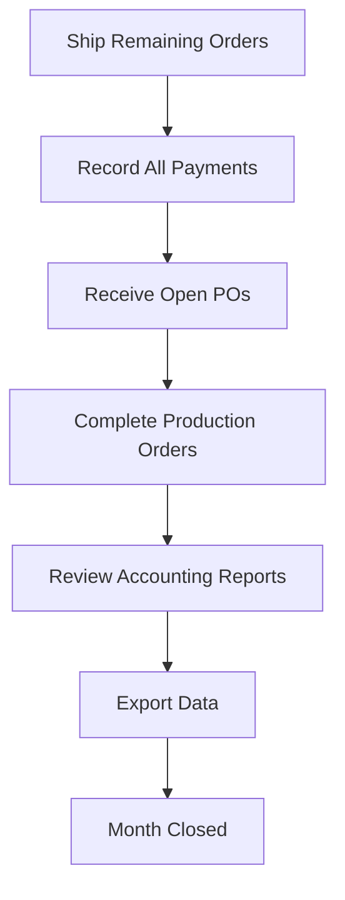

# Month-End Close

> A checklist for closing your books at the end of each month.

This workflow ensures your financial records are accurate and complete before you move into the next month. Follow these steps in order — later steps depend on earlier ones being done first.

---

## The Flow

---

## Step 1: Ship Remaining Orders

Make sure all orders that were fulfilled this month are marked as shipped.

**Where:** **Sales > Orders**

1. Filter for **Confirmed** or **In Progress** orders
2. For any orders that have been delivered but not marked shipped, update them now
3. Shipping an order triggers revenue recognition in the accounting reports

!!! warning "Don't back-date"
    Ship orders on the actual ship date. If an order shipped last week but wasn't recorded, ship it now — the system records the current date, which is still within the correct month.

**Details:** [Taking and Fulfilling Orders](../orders.md)

---

## Step 2: Record All Payments

Enter any payments received this month that haven't been recorded yet.

**Where:** **Sales > Orders** > open each order > Payment section

1. Check for orders with **Unpaid** or **Partial** payment status
2. Record any payments received (checks cleared, transfers completed, etc.)
3. Verify payment methods are correct for each entry

The Payments tab in Accounting should now reflect all cash received this month.

**Details:** [Taking and Fulfilling Orders](../orders.md) and [Basic Accounting](../accounting.md)

---

## Step 3: Receive Open Purchase Orders

Record any materials received this month.

**Where:** **Purchasing > Purchase Orders**

1. Filter for POs with status **Ordered** or **Partial**
2. For any deliveries received but not yet recorded, process the receipt now
3. Receiving updates inventory quantities and records the expense

**Details:** [Ordering Supplies](../purchasing.md)

---

## Step 4: Complete Production Orders

Close out any finished production work.

**Where:** **Manufacturing > Production**

1. Filter for production orders with status **In Progress**
2. For any completed jobs, mark them as **Completed**
3. For any failed jobs, scrap them with an appropriate [scrap reason](../system-settings.md)
4. Don't close production orders that are genuinely still in progress — they'll carry into next month

**Details:** [Running Production](../production.md)

---

## Step 5: Review Accounting Reports

With all transactions recorded, review your financial reports for accuracy.

**Where:** **Accounting** tabs

### Dashboard
Verify that Revenue MTD, Cash Received MTD, and Gross Profit MTD look reasonable for the month.

### Sales Journal
1. Set the date range to the full month
2. Scan for any unusual entries or missing orders
3. Verify the grand total matches your expectations

### Payments
1. Set the date range to the full month
2. Confirm total payments match your bank deposits
3. Check the "By Payment Method" breakdown for accuracy

### COGS
1. Set the period to 30 days
2. Review the gross margin — is it consistent with prior months?
3. If margin changed significantly, investigate which cost component shifted

### Tax Center
1. Set the period to **Monthly**
2. Note the **Tax Collected** figure — this is what you owe
3. Check for **Pending Tax** from unshipped orders (these carry to next month)

**Details:** [Basic Accounting](../accounting.md)

---

## Step 6: Export Data

Download your reports for record-keeping and tax preparation.

**Where:** **Accounting** tabs > **Export CSV** buttons

Export these files and save them in your monthly records folder:

1. **Sales Journal** — `sales-journal-{start}-to-{end}.csv`
2. **Payments** — `payments-journal-{start}-to-{end}.csv`
3. **Tax Summary** — `tax-summary-month.csv`

!!! tip "Share with your accountant"
    If you work with an accountant or bookkeeper, these three exports give them everything they need to reconcile your books without needing access to FilaOps.

---

## Month-End Checklist

- [ ] All shipped orders marked as shipped in FilaOps
- [ ] All received payments recorded
- [ ] All material receipts processed
- [ ] Completed production orders closed
- [ ] Failed production orders scrapped with reasons
- [ ] Accounting Dashboard reviewed — revenue and profit reasonable
- [ ] Sales Journal reviewed for completeness
- [ ] Payments reconciled with bank deposits
- [ ] COGS and margin reviewed for consistency
- [ ] Tax liability noted for remittance
- [ ] Sales Journal CSV exported
- [ ] Payments CSV exported
- [ ] Tax Summary CSV exported
