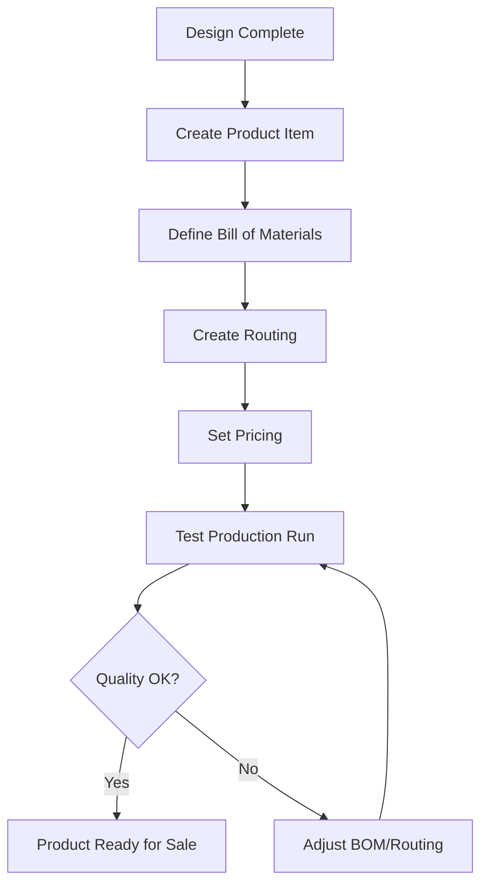

# New Product Launch

> Everything you need to set up a new product in FilaOps — from item creation to first production run.

This workflow walks through adding a completely new product to your catalog, including its Bill of Materials, routing, and first test production.

---

## The Flow

---

## Step 1: Create the Product Item

Add the finished product to your item catalog.

**Where:** **Inventory > Items > + New Item**

1. Enter the product name and SKU
2. Set the item type to **Finished Good** or **Manufactured**
3. Set the unit of measure (each, kg, meter, etc.)
4. Add a description and any other details
5. Save the item

!!! tip "Don't forget raw materials"
    If your new product uses materials that aren't already in your catalog, add those first. You'll need them when defining the Bill of Materials.

**Details:** [Managing Your Product Catalog](../product-catalog.md)

---

## Step 2: Define the Bill of Materials

Specify exactly what materials and quantities go into one unit of your product.

**Where:** **Manufacturing > Bills of Materials > + New BOM**

1. Select your new product as the parent item
2. Add each raw material or component as a BOM line
3. For each line, specify the quantity needed per unit of finished product
4. If you have waste or scrap allowances, include those in the quantities

The BOM is what drives MRP calculations and COGS reporting, so accuracy matters.

**Details:** [Managing Your Product Catalog](../product-catalog.md)

---

## Step 3: Create a Routing

Define the production steps (operations) needed to manufacture the product.

**Where:** **Manufacturing > Routings > + New Routing**

1. Select your new product
2. Add operations in sequence (e.g., "Print", "Post-Process", "Quality Check", "Package")
3. For each operation, set the work center and estimated time
4. Save the routing

The routing determines the production workflow operators follow when manufacturing this product.

**Details:** [Running Production](../production.md)

---

## Step 4: Set Pricing

Configure the selling price for your new product.

**Where:** **Inventory > Items** > open the product > pricing fields

1. Set the **Selling Price** — what customers pay
2. Review the **Cost** — FilaOps calculates this from the BOM (materials) and routing (labor)
3. Verify the margin meets your targets

!!! tip "Cost sanity check"
    After setting up the BOM and routing, the calculated cost should make sense for your product. If it seems too high or too low, double-check your material costs and labor rates in the BOM and routing.

**Details:** [Managing Your Product Catalog](../product-catalog.md)

---

## Step 5: Test Production Run

Before accepting customer orders, do a test run to validate your BOM and routing.

**Where:** **Manufacturing > Production > + New Production Order**

1. Create a production order for a small quantity (1–3 units)
2. Walk through each operation in the routing
3. Track actual times vs. estimated times
4. Note any material usage differences from the BOM

---

## Step 6: Adjust and Finalize

Based on your test run:

- **BOM adjustments** — Update material quantities if actual usage differed from estimates
- **Routing adjustments** — Update operation times if actual production took longer or shorter
- **Pricing review** — Recalculate your selling price if costs changed significantly

Once you're satisfied with the test results, the product is ready for customer orders.

---

## Step 7: Run MRP

With a new product in the catalog, make sure you have materials on hand.

**Where:** **Manufacturing > MRP > Run MRP**

MRP will identify any material shortages based on the new product's BOM and generate planned purchase orders if needed.

**Details:** [Material Planning (MRP)](../mrp.md)

---

## Quick Checklist

- [ ] Product item created with correct type and UOM
- [ ] Raw materials added to catalog (if not already present)
- [ ] Bill of Materials defined with accurate quantities
- [ ] Routing created with operations and time estimates
- [ ] Selling price set with acceptable margin
- [ ] Test production order completed successfully
- [ ] BOM and routing adjusted based on test results
- [ ] MRP run to check material availability
- [ ] Product ready for customer orders
