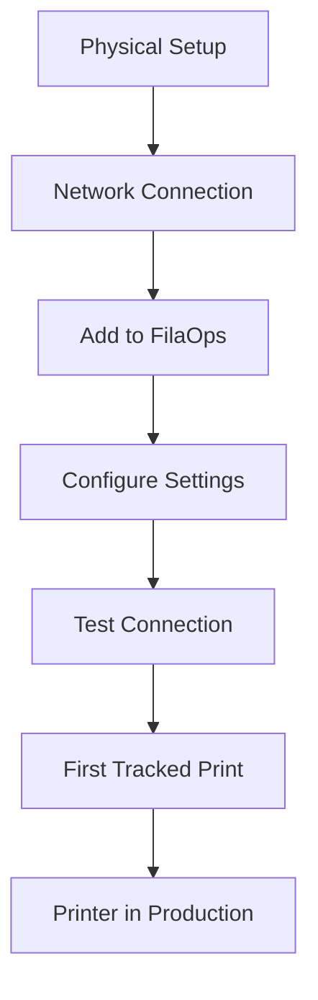

# Onboarding a Printer

> Add a new printer to your FilaOps fleet — from unboxing to first tracked print.

This workflow covers everything needed to get a new printer connected, configured, and ready for production tracking in FilaOps.

---

## The Flow

---

## Step 1: Physical Setup

Before touching FilaOps, get the printer physically ready:

1. Unbox and assemble the printer per manufacturer instructions
2. Level the bed and load filament
3. Run the manufacturer's test print to verify the hardware works
4. Connect the printer to your local network (Ethernet or Wi-Fi)

---

## Step 2: Connect to Your Network

Your printer needs to be on the same network as your FilaOps server for MQTT monitoring to work.

**For Ethernet printers:** Plug in the cable and note the IP address from the printer's display or network settings.

**For Wi-Fi printers:** Connect to your Wi-Fi network through the printer's settings menu and note the assigned IP address.

!!! tip "Static IP recommended"
    Assign a static IP address to each printer (either on the printer or via your router's DHCP reservation). This prevents connection issues when IP addresses change after a power cycle.

---

## Step 3: Add the Printer to FilaOps

You have two options for adding printers.

### Option A: Network Discovery

**Where:** **Printers > Fleet Management > Discover**

1. Click **Discover** to scan your local network
2. FilaOps searches for printers running common protocols (OctoPrint, Klipper/Moonraker, etc.)
3. Select your new printer from the discovered devices
4. Confirm the connection details

### Option B: Manual Entry

**Where:** **Printers > Fleet Management > + Add Printer**

1. Click **+ Add Printer**
2. Fill in the printer details:

| Field | Notes |
|-------|-------|
| **Name** | A descriptive name (e.g., "Prusa MK4 #3" or "Ender Bay-A2") |
| **IP Address** | The printer's network address |
| **Type/Model** | Printer model or type |
| **Location** | Physical location in your facility |
| **MQTT Topic** | The MQTT topic this printer publishes to (if using MQTT monitoring) |

3. Save the printer

### Option C: Bulk Import

**Where:** **Printers > Fleet Management > Import CSV**

For adding many printers at once, prepare a CSV file with columns for name, IP, model, and location, then import it.

**Details:** [Monitoring Your Printers](../printers.md)

---

## Step 4: Configure Printer Settings

After adding the printer, open its detail view to configure additional settings.

**Where:** **Printers > Fleet Management** > click the printer name

Review and set:

- **Maintenance schedule** — Set the interval for regular maintenance reminders
- **Build volume** — Width, depth, and height of the print area
- **Default material** — The filament type typically loaded on this printer
- **Notes** — Any special instructions or quirks about this specific machine

---

## Step 5: Test the Connection

Verify that FilaOps can communicate with the printer.

1. Check the printer's status indicator in Fleet Management — it should show **Online** or **Idle**
2. If using MQTT, verify that status updates are flowing (the printer card should update in real time)
3. If the printer shows **Offline**, check:
   - Is the printer powered on and connected to the network?
   - Is the IP address correct?
   - Is the printer's API enabled (OctoPrint requires API key setup)?
   - Are there firewall rules blocking communication?

---

## Step 6: First Tracked Print

Run a production print to verify everything works end-to-end.

1. Create a small production order for a product assigned to this printer
2. Start the print job
3. Verify that FilaOps picks up the print status (started, progress, completed)
4. Confirm the production order updates when the print finishes

If status tracking doesn't work, the printer is still usable — you can manually update production order status. But automated tracking saves significant operator time.

---

## Onboarding Checklist

- [ ] Printer assembled and hardware test print completed
- [ ] Connected to local network with known IP address
- [ ] Added to FilaOps fleet (discovery, manual, or CSV import)
- [ ] Printer name and location set descriptively
- [ ] Maintenance schedule configured
- [ ] Connection verified — printer shows online in FilaOps
- [ ] First tracked print completed successfully
- [ ] Printer ready for production assignments
