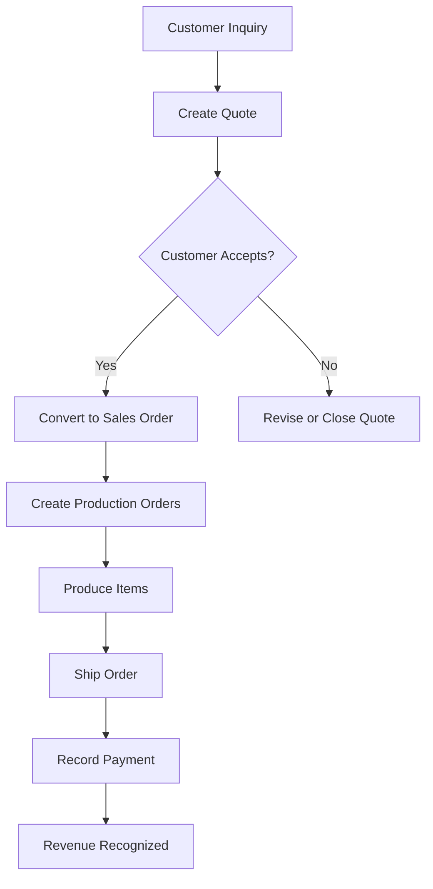

# Quote to Cash

> The complete lifecycle of a customer transaction — from initial inquiry to money in the bank.

This workflow walks through every step of converting a customer request into revenue. Each step links to the detailed page where you can learn more.

---

## The Flow

---

## Step 1: Create a Quote

When a customer requests a price, create a quote with itemized pricing.

**Where:** **Sales > Quotes > + New Quote**

1. Select or create the customer
2. Add line items with products, quantities, and prices
3. Review the total (including tax if enabled)
4. Send the quote to the customer

The quote is valid for the number of days set in your [quote settings](../system-settings.md). Track its status as **Draft**, **Sent**, **Accepted**, or **Rejected**.

**Details:** [Taking and Fulfilling Orders](../orders.md)

---

## Step 2: Convert to a Sales Order

When the customer accepts, convert the quote into a sales order with one click.

**Where:** Open the quote > **Convert to Order**

FilaOps creates a sales order pre-filled with all line items, quantities, and pricing from the quote. The order starts in **Confirmed** status.

**Details:** [Taking and Fulfilling Orders](../orders.md)

---

## Step 3: Create Production Orders

For each item that needs to be manufactured, create a production order.

**Where:** **Manufacturing > Production > + New Production Order**

1. Select the product and quantity from the sales order
2. FilaOps pulls the Bill of Materials and routing automatically
3. The production order starts in **Draft** status — change to **In Progress** when you're ready to start

!!! tip "Check materials first"
    Before starting production, make sure you have enough raw materials. Run [MRP](../mrp.md) or check the [Low Stock](../purchasing.md) tab to identify shortages.

**Details:** [Running Production](../production.md)

---

## Step 4: Produce the Items

Work through each production operation, tracking time and material consumption.

**Where:** **Manufacturing > Production** > open the production order

1. Start each operation and record actual time
2. When all operations are complete, mark the production order as **Completed**
3. Finished goods are added to inventory automatically

If something goes wrong, you can scrap the production order with a [scrap reason](../system-settings.md) to track the failure.

**Details:** [Running Production](../production.md)

---

## Step 5: Ship the Order

Once items are produced and in stock, ship the sales order.

**Where:** **Sales > Orders** > open the order > **Ship**

1. Confirm the shipping details
2. Mark the order as **Shipped**
3. FilaOps deducts inventory and records revenue

!!! info "Revenue recognition"
    Revenue appears in your [accounting reports](../accounting.md) only after the order is shipped. This is accrual-basis accounting — income is recognized when earned, not when payment is received.

**Details:** [Taking and Fulfilling Orders](../orders.md)

---

## Step 6: Record Payment

When the customer pays, record the payment against the order.

**Where:** **Sales > Orders** > open the order > Payment section

1. Enter the payment amount and method
2. FilaOps updates the order's payment status to **Paid** or **Partial**
3. Cash received appears in the [Payments tab](../accounting.md) in Accounting

**Details:** [Taking and Fulfilling Orders](../orders.md)

---

## Step 7: Verify in Accounting

Confirm the transaction flowed through correctly.

**Where:** **Accounting** tabs

- **Dashboard** — Revenue MTD and Cash Received should reflect the order
- **Sales Journal** — The shipped order appears with line item details
- **Payments** — The recorded payment appears with method and amount
- **Tax Center** — If tax was charged, it appears in the tax summary

**Details:** [Basic Accounting](../accounting.md)

---

## Quick Checklist

- [ ] Quote created and sent to customer
- [ ] Quote accepted and converted to sales order
- [ ] Production orders created for manufactured items
- [ ] Production completed and goods in stock
- [ ] Sales order shipped
- [ ] Payment recorded
- [ ] Revenue verified in accounting
