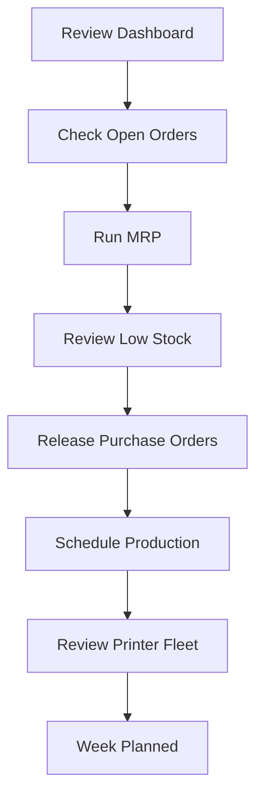

# Weekly Planning Cycle

> A Monday morning routine to keep your print farm running smoothly all week.

This workflow is a repeatable checklist you can follow at the start of each week to review demand, plan production, and order materials. Adjust the cadence to fit your business — high-volume farms may benefit from doing this daily.

---

## The Flow

---

## Step 1: Review the Dashboard

Start with a high-level view of where things stand.

**Where:** **Dashboard**

Look at:

- **Open orders** — How many orders are waiting to be fulfilled?
- **Production status** — Are there production orders stuck in progress?
- **Low stock alerts** — Are any materials critically low?
- **Revenue trends** — How is this week comparing to last?

**Details:** [Understanding the Dashboard](../dashboard.md)

---

## Step 2: Check Open Orders

Review all orders that need attention this week.

**Where:** **Sales > Orders**

1. Filter by status to see **Confirmed** orders (ready to produce)
2. Sort by due date to prioritize what ships first
3. Note any orders that are blocked by missing materials or incomplete production

**Details:** [Taking and Fulfilling Orders](../orders.md)

---

## Step 3: Run MRP

Let FilaOps calculate what materials you need for the week ahead.

**Where:** **Manufacturing > MRP > Run MRP**

1. Set the planning horizon to match your planning window (7–14 days for weekly planning)
2. Consider enabling **Include Draft Orders** if you have likely quotes
3. Click **Run MRP**
4. Review the material requirements table — focus on items with a positive **Net Shortage**

**Details:** [Material Planning (MRP)](../mrp.md)

---

## Step 4: Review Low Stock

Check what needs to be ordered, combining MRP results with reorder point alerts.

**Where:** **Purchasing > Low Stock**

1. Review items flagged by MRP, reorder points, or both
2. For each shortage, note the quantity needed and lead time
3. Prioritize orders for materials needed soonest

**Details:** [Ordering Supplies](../purchasing.md)

---

## Step 5: Release Purchase Orders

Convert MRP suggestions and low-stock alerts into actual purchase orders.

**Where:** **Manufacturing > MRP** (for planned orders) or **Purchasing > Purchase Orders**

1. Firm any planned purchase orders you agree with
2. Release firmed orders — select the vendor and confirm
3. For items not covered by MRP, create purchase orders manually
4. Verify all POs have been sent to vendors

**Details:** [Ordering Supplies](../purchasing.md) and [Material Planning (MRP)](../mrp.md)

---

## Step 6: Schedule Production

Plan what to produce this week based on order priorities and material availability.

**Where:** **Manufacturing > Production**

1. Create production orders for confirmed sales orders
2. Prioritize by due date and material availability
3. Assign production orders to available work centers
4. Set production orders to **In Progress** when ready to start

!!! tip "Don't overcommit"
    Only schedule production for orders where materials are in stock or arriving in time. Starting production without materials creates bottlenecks.

**Details:** [Running Production](../production.md)

---

## Step 7: Review Printer Fleet

Make sure your equipment is ready for the week's production.

**Where:** **Printers > Fleet Management**

1. Check printer statuses — are all printers online and operational?
2. Review any printers flagged for maintenance
3. Note printers with upcoming maintenance schedules
4. Address any offline or error-state printers before production starts

**Details:** [Monitoring Your Printers](../printers.md)

---

## Weekly Planning Checklist

- [ ] Dashboard reviewed for alerts and trends
- [ ] Open orders reviewed and prioritized by due date
- [ ] MRP run with appropriate planning horizon
- [ ] Low stock items identified
- [ ] Purchase orders created and sent to vendors
- [ ] Production orders created and scheduled
- [ ] Printer fleet checked and ready
